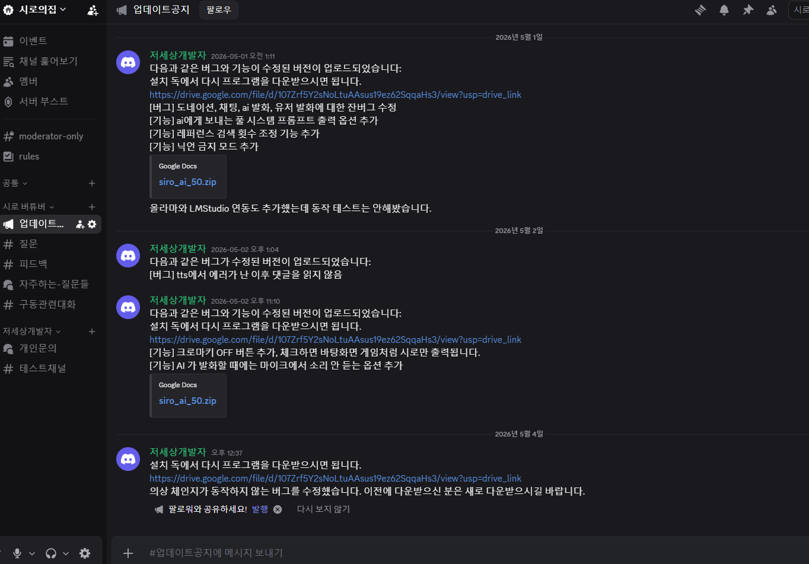

# 00. 개요

시로 AI 버튜버는 **대화·음성 인식·음성 합성·Live2D 캐릭터 표시**를 한 프로그램으로 제공하는 AI 버튜버 방송 도구입니다. 실행하면 캐릭터 창이 함께 뜹니다.

[[TIP("시작하기")]]
처음이시면 **[01. 시작하기](https://wikidocs.net/372516)** 순서로 읽어 주세요.
[[/TIP]]

## 구성 요소

| 구성 | 역할 |
|------|------|
| **AI 버튜버 실행 프로그램** | LLM 대화, STT, TTS, Live2D·자막·오버레이, 채팅·후원 연동 |
| **GPT-SoVITS** (선택) | 로컬 TTS 엔진 — `tts 모듈` 사용 시 자동 기동 |

## 다운로드

- [Hugging Face — sesang06/siro_vtuber](https://huggingface.co/buckets/sesang06/siro_vtuber)
- **`siro_ai.zip`** (일반 GPU), **`siro_ai_50.zip`** (50xx대 GPU)

## 빠른 시작

1. [01. 시작하기](https://wikidocs.net/372516) — 요구사항·설치·API 키·첫 실행
2. **프로그램 시작** 클릭
3. 마이크로 말하면 AI가 응답합니다

## 이용 조건

### 모델 무단 배포 금지

Live2D 모델과 음성 소스의 저작권은 각 제작자에게 있으며, **허가 없이 사용하는 행위 및 무단 배포는 금지**합니다.

### 보이스 및 모델의 비정상적 용도 사용 금지

예: AI 외의 용도로 사용하는 경우, 개인 방송에 그대로 사용하는 등

- **가능** — 개인 방송에서 AI 시로를 **구동용**으로 사용
- **불가** — 시로 Live2D 아바타로 방송인 본인이 **연기**하는 용도

### API 비용

구동 시 **Gemini API 키** 사용량이 Google에 청구되며, **비용은 각자 부담**하셔야 합니다.

방송용으로 적극적으로 사용할 때 **시간당 약 0.5~1달러** 정도 소모되는 경우가 많습니다. (STT·TTS·LLM 조합·발화량에 따라 달라집니다.)

## 이용 허가 / 불가 예시

| 허가되는 경우 | 불허되는 경우 |
|---------------|---------------|
| 유튜브, 치지직, 트위치, 숲 등에서 **시로 AI와 함께** 방송 | 시로 AI Live2D 아바타를 **booth 등에 배포** |
| 방송 중 **제3자 게임 광고**로 수익 창출 | 시로 AI Live2D 아바타로 **방송인 본인이 페르소나를 연기** |
| 방송 중 **후원** 수령 | |
| 방송 **편집본**을 유튜브에 올려 수익 창출 | |
| 시로의 프롬프트·Live2D·목소리를 설정해 **시로가 아닌 다른 페르소나**로 별도 사용 | |

## 방송인 협력 지원

- 방송에 시로 AI를 사용하는 것은 **별도 허가 없이** 가능합니다. 시로 AI로 진행한 방송·유튜브·키리누키 등은 **자유롭게** 이용하실 수 있습니다.
- 시로 AI와 함께한 방송의 **후원금**, **조회수 수익**, **광고 수입**을 요구하지 않습니다.
- **방송인 한정**으로 설치 지원·목소리 모듈 지원을 제공합니다. 문의: [Discord](https://discord.com/invite/Dj9nBPCZv6) 또는 [over.horizon.dev@gmail.com](mailto:over.horizon.dev@gmail.com)
- **방송인 한정**으로 Live2D 모델·목소리 모듈·성격 교체도 가능합니다. 문의: [over.horizon.dev@gmail.com](mailto:over.horizon.dev@gmail.com) — Live2D 모델은 **본인이 준비**해 주셔야 교체할 수 있습니다.

## 문의용 디스코드

**프로그램 문의 / 피드백:** [Discord](https://discord.com/invite/Dj9nBPCZv6) · [over.horizon.dev@gmail.com](mailto:over.horizon.dev@gmail.com)

프로그램 **업데이트**는 디스코드 **#업데이트공지** 채널에서 안내합니다.

## 메뉴얼 구성

| 섹션 | 내용 |
|------|------|
| [시작하기](https://wikidocs.net/372516) | 설치·실행·첫 사용 |
| [UI 설정](https://wikidocs.net/372517) | 앱 패널별 설정 (AI·캐릭터·방송 등) |
| [문제 해결](https://wikidocs.net/372522) | 트러블슈팅·[변경 이력](https://wikidocs.net/372523) |
| [파인튜닝 협조](https://wikidocs.net/372487) | [JSONL 편집기](https://editor-two-virid.vercel.app/)에서 대화 예시 교정 — 추후 시로 AI 파인튜닝 자료로 사용 |

## 도움이 필요할 때

- [문제 해결](https://wikidocs.net/372522)
- [변경 이력](https://wikidocs.net/372523)

## 파인튜닝 협조 요청

시로 AI의 **말투·성격·대화 품질**을 더 좋게 만들기 위해, 방송·테스트 대화를 JSONL 형태로 모아 **파인튜닝 학습 데이터**로 쓸 예정입니다. 지금은 웹 편집기에서 예시를 함께 다듬어 주시면 큰 도움이 됩니다.

**[JSONL 편집기](https://editor-two-virid.vercel.app/)** 에 접속해 USER·ASSISTANT 턴을 읽고, 어색한 표현·OOC(캐릭터 붕괴)·오타를 고쳐 주세요. **승인·반영된 수정분은 추후 시로 AI 파인튜닝 자료에 포함**됩니다.

### 편집기 사용 요약

| 영역 | 설명 |
|------|------|
| **파일 목록** (좌측) | `1.jsonl` ~ `21.jsonl` — 대화 묶음별 파일 |
| **예시 목록** (중앙) | 한 파일 안의 대화 예시. `#1`, `#2` … 항목을 골라 편집 |
| **편집 영역** (우측) | USER / ASSISTANT 턴별 텍스트 수정, 턴 추가·삭제 |

- **게스트 모드** — 로그인 없이 편집 가능. 저장하면 **승인 대기(pending)** 상태로 올라가며, 검토 후 반영됩니다.
- **즉시 저장** — `Ctrl+S` (또는 우측 상단 버튼)
- **예시 삭제** — `Ctrl+D`
- **이동** — `Ctrl+J` 또는 이전/다음 버튼으로 예시 간 이동

[[TIP("협조 부탁")]]
시로답게 들리도록 ASSISTANT 턴 위주로 봐 주셔도 좋습니다. 말투가 어색하거나 설정과 맞지 않으면 고쳐 주시고, **저장**까지 눌러 주세요. 여러 사람이 동시에 다른 예시를 편집할 수 있습니다.
[[/TIP]]
