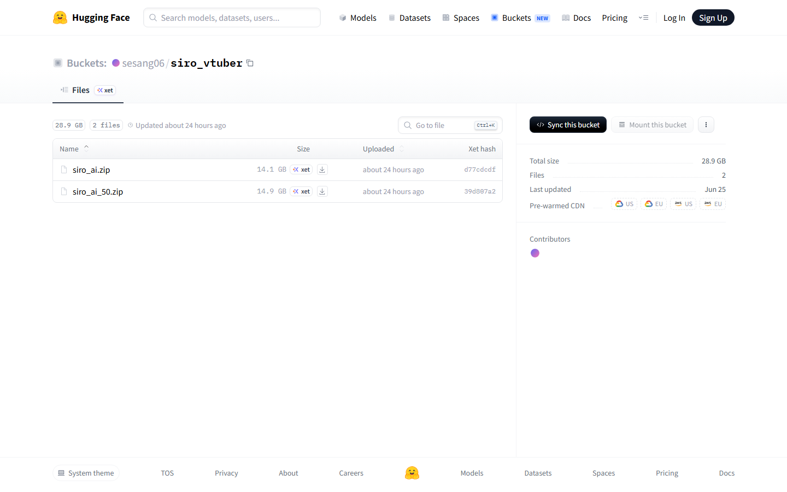
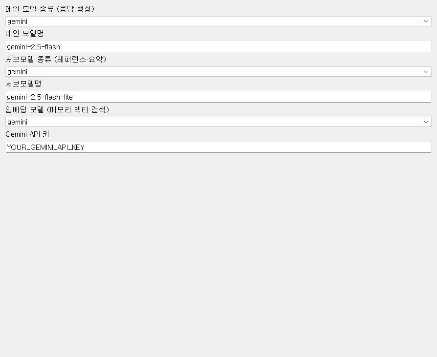
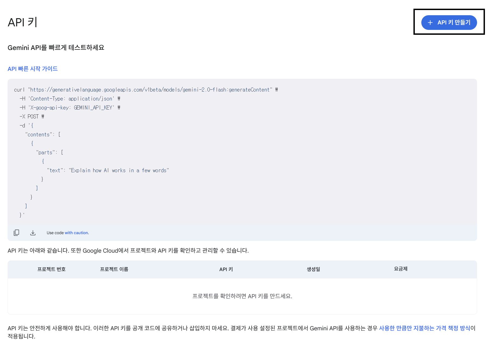
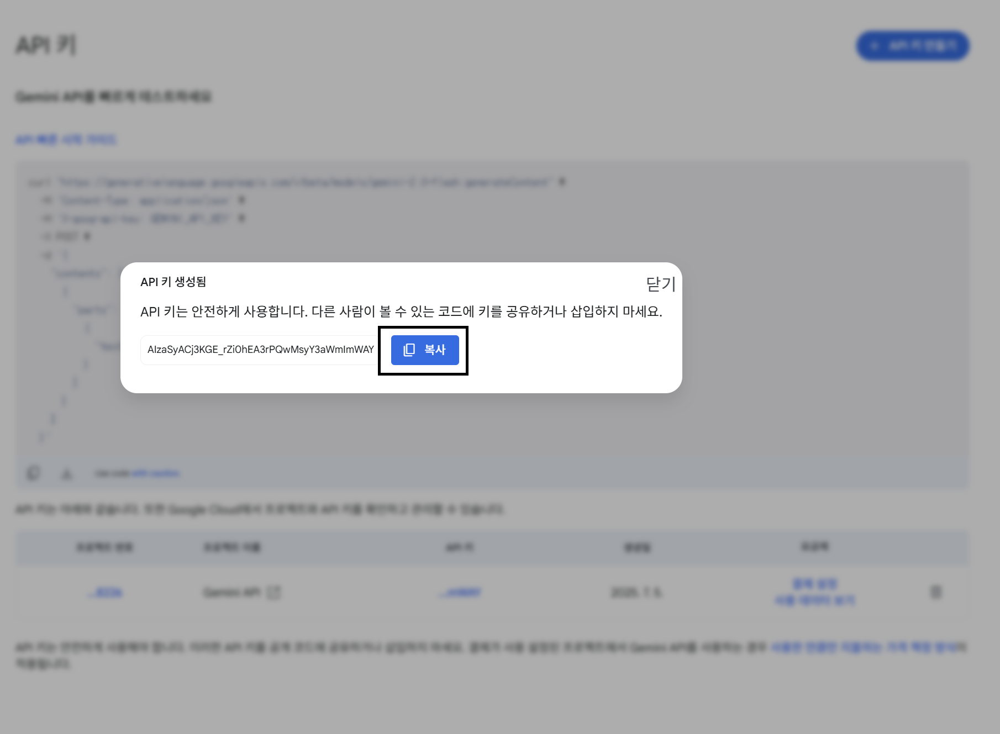
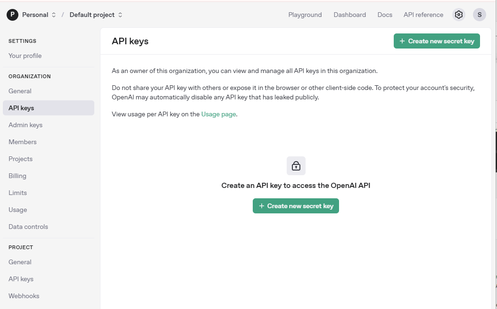
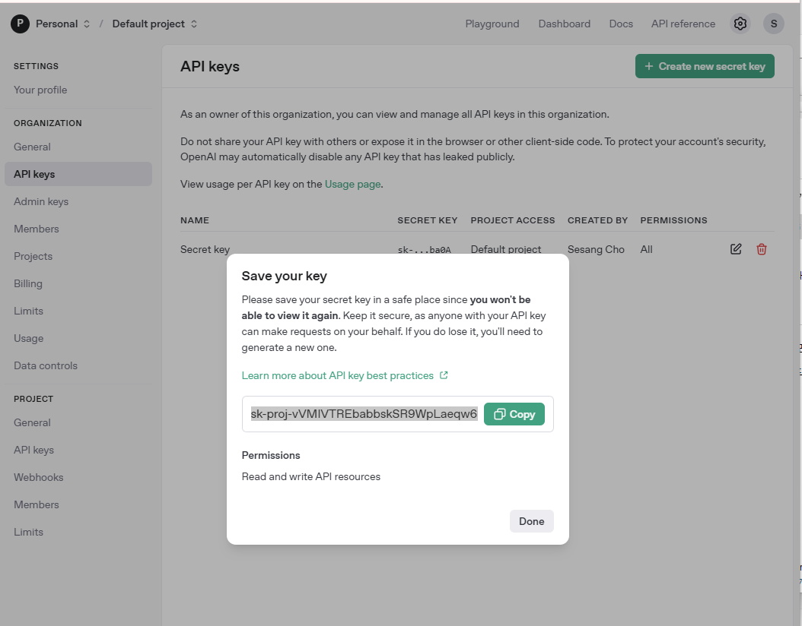
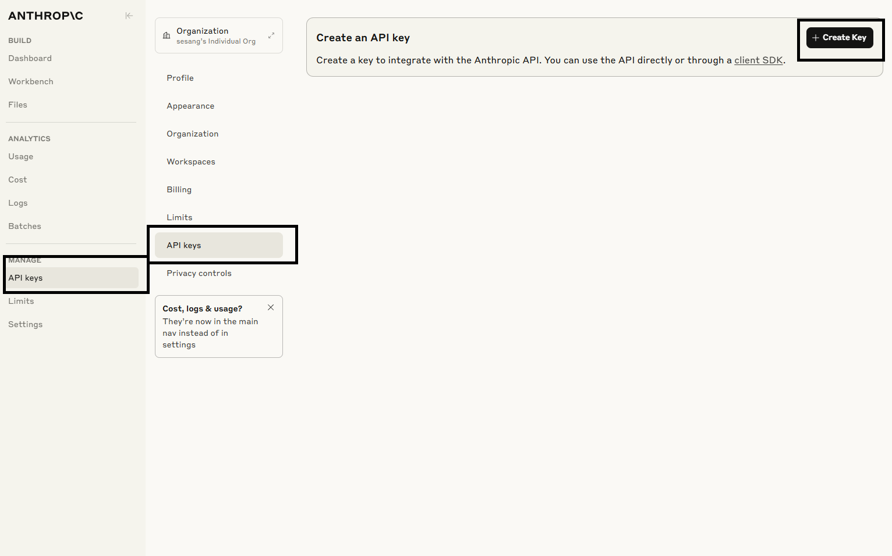

# 01. 시작하기

[[TIP("업데이트 안내")]]
**2026-05-04** 의상 체인지가 동작하지 않는 버그를 수정했습니다. 이전에 다운받으신 분은 새로 다운받으시길 바랍니다.
[[/TIP]]

## 시스템 요구사항

### AI 버튜버 실행 프로그램

| 항목 | 권장 |
|------|------|
| OS | Windows 10/11 (64-bit) |
| GPU | NVIDIA GPU + CUDA (Whisper 로컬 STT, GPT-SoVITS 사용 시). Live2D 렌더링 가능한 그래픽 카드 |
| RAM | 16 GB 이상 권장 |
| 디스크 | 10 GB 이상 여유 (모델·캐릭터 데이터 포함) |
| 네트워크 | LLM·클라우드 STT/TTS 사용 시 인터넷 필요 |

### API 키 (선택 조합)

| 제공자 | 용도 |
|--------|------|
| Google Gemini | 메인 LLM (기본) |
| OpenAI | LLM, OpenAI Realtime STT, 임베딩 |
| Anthropic Claude | LLM |
| xAI Grok | LLM |
| Supertone | 클라우드 TTS |
| MiniMax | 클라우드 TTS (방송용 권장, [Starter Pack 약 5달러/월](https://www.minimax.io/audio/subscribe)) |

**STT/TTS 조합 요약**

- **방송·스트리밍** — OpenAI Realtime STT + MiniMax TTS ([오디오·음성](https://wikidocs.net/372528) 권장 구성 참고)
- **무료 로컬** — faster-whisper STT + GPT-SoVITS(`tts 모듈`) TTS → LLM API 외 STT/TTS API는 생략 가능

### 선택 구성

- **GPT-SoVITS 서버** — `tts 모듈` 선택 시 프로그램이 로컬 서버를 기동합니다

### 경로·환경 주의

- 프로그램 경로와 **상위 폴더**에 한글·공백을 넣지 마세요.
- Windows **사용자 폴더 이름이 한글**이면 구동되지 않을 수 있습니다. [Windows 사용자 폴더 영문 변경 (YouTube)](https://www.youtube.com/watch?v=jBRkP4AV5rI) 참고.
- 이어폰 사용을 권장합니다. 시로 목소리가 마이크로 재인식되는 에코를 막기 위함입니다.

## 설치

### 1. 실행 프로그램 다운로드

1. [Hugging Face 버킷](https://huggingface.co/buckets/sesang06/siro_vtuber)에 접속합니다.
2. GPU에 맞는 zip을 받습니다.
   - 일반: **`siro_ai.zip`**
   - 50xx대 GPU: **`siro_ai_50.zip`**
3. 원하는 폴더에 **압축을 해제**합니다. (예: `C:\siro_ai\`)

[[TIP("TIP")]]
경로에 한글이나 특수문자가 없을수록 안정적입니다.
[[/TIP]]

동영상 설치 방법: [동영상 설치 가이드 (YouTube)](https://youtube.com/live/bX-o5H6UAUE)

### 2. API 키 설정

API 키는 **프로그램 UI에서 입력**하면 됩니다. 파일을 직접 편집할 필요는 없습니다.

1. `main_pyqt.exe` 실행
2. 좌측 **AI 모델** 탭 선택
3. **메인 모델 종류**에서 사용할 LLM 선택 (Gemini 권장)
4. 선택한 제공자에 맞는 **API 키** 입력란에 붙여넣기

입력한 값은 **자동 저장**됩니다. 키 입력란은 비밀번호처럼 가려져 표시됩니다.

STT·TTS API 키(Supertone, MiniMax, OpenAI Realtime 등)는 [오디오·음성](https://wikidocs.net/372528) 탭에서 같은 방식으로 설정합니다.

#### Gemini 키 발급 (권장)

[Google AI Studio — API 키](https://aistudio.google.com/app/apikey?hl=ko)에서 **API 키 만들기** → 키 복사 → **AI 모델** 탭 **Gemini API 키**에 붙여넣기.

#### OpenAI 키 (선택)

[OpenAI API Keys](https://platform.openai.com/settings/organization/api-keys)에서 키 생성 → **AI 모델** 탭 **OpenAI API 키** (ChatGPT·임베딩) 및 **오디오·음성** 탭 Realtime STT에 사용. [OpenAI Billing](https://platform.openai.com/settings/organization/billing/overview)에서 크레딧 충전이 필요할 수 있습니다.

#### Claude 키 (선택)

[Claude API Keys](https://console.anthropic.com/settings/keys)에서 키 생성 → **AI 모델** 탭 **Claude API 키**에 붙여넣기.

## 첫 실행

1. **AI 버튜버 실행 프로그램** (`main_pyqt.exe` 또는 배포 런처)을 실행합니다. **캐릭터 표시 창**이 함께 뜹니다.
2. 좌측 탭에서 **AI 모델** — LLM과 API 키를 확인합니다.
3. **캐릭터** 탭 — 캐릭터 폴더·시나리오를 선택합니다.
4. **오디오·음성** 탭 — 마이크, STT, TTS 모듈을 설정합니다. 방송이면 **OpenAI Realtime + MiniMax**, 연습·무료면 **Whisper + tts 모듈**. ([오디오·음성](https://wikidocs.net/372528) 참고)
5. 우측 **실행 제어** → **프로그램 시작**을 클릭합니다.
6. 초기화가 끝나면 마이크로 말해 보세요.

### 실행 제어 패널

우측 **실행 제어**에서 **프로그램 시작**으로 백엔드를 켭니다. 자세한 설명은 [실행 제어](https://wikidocs.net/372534) 페이지를 보세요.

- **프로그램 시작** — STT·TTS·채팅 모니터 기동
- **채팅 열기** — 텍스트로 AI와 대화 (테스트)
- **크로마키 ON/OFF** — OBS 합성용 배경 모드 (ON=그린 스크린·크로마키 필터, OFF=투명 창 오버레이). [실행 제어](https://wikidocs.net/372534) 참고
- **AI 발화 중단** · **마이크 뮤트** — 방송 중 즉시 제어
- **말하기 모드 (3단계)** · **AI 발화 중 마이크 음소거** — 목소리 겹침 방지

### 정상 동작 확인

- 캐릭터 창에 Live2D 모델이 보입니다
- **프로그램 시작** 후 마이크로 말하면 자막이 표시되고 AI가 응답합니다

문제가 있으면 [문제 해결](https://wikidocs.net/372522)을 참고하세요.

## 자막·캐릭터 화면

- 문장마다 **현재 말하는 문장 1개만** 화면에 표시됩니다.
- TTS **재생이 끝난 뒤** 마지막 자막이 약 5초간 유지된 후 사라집니다.

Live2D 모델·표정·의상은 [라투디](https://wikidocs.net/372532) 탭에서 설정합니다.

## 업데이트

새 zip을 받아 기존 폴더를 덮어쓰기 전에 설정 백업을 권장합니다. [설정 관리](https://wikidocs.net/372533)의 **설정 내보내기**를 사용할 수 있습니다.

## 문의

- [Discord](https://discord.com/invite/Dj9nBPCZv6)
- [over.horizon.dev@gmail.com](mailto:over.horizon.dev@gmail.com)
