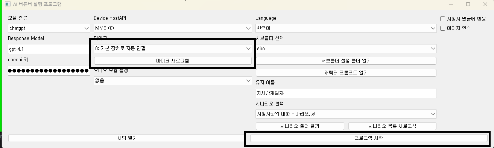
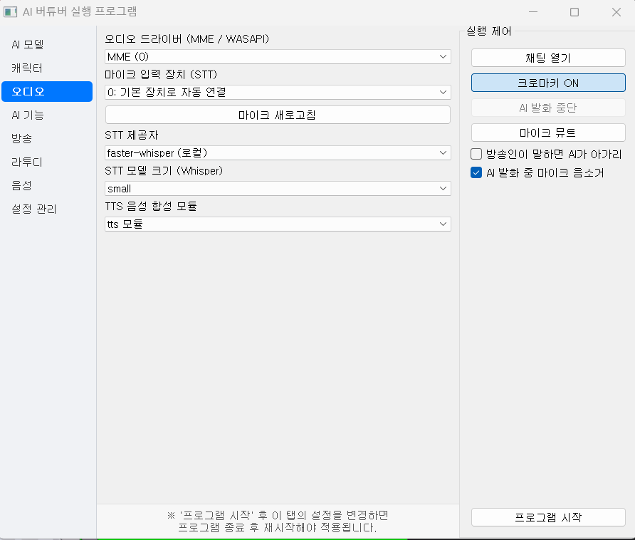
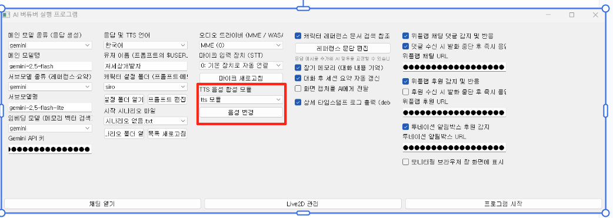
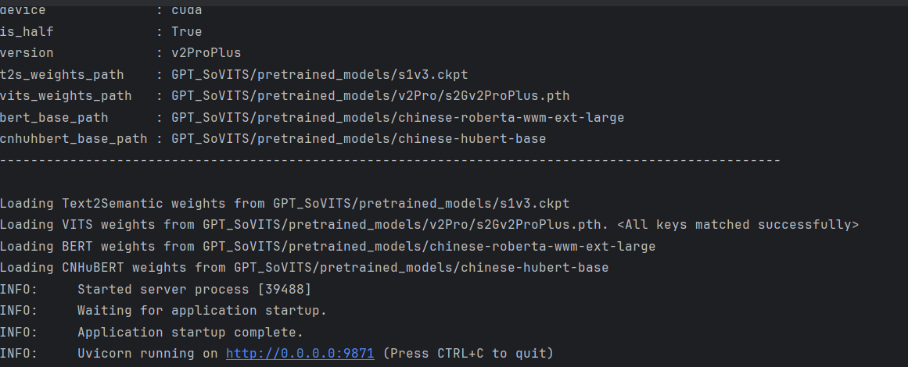
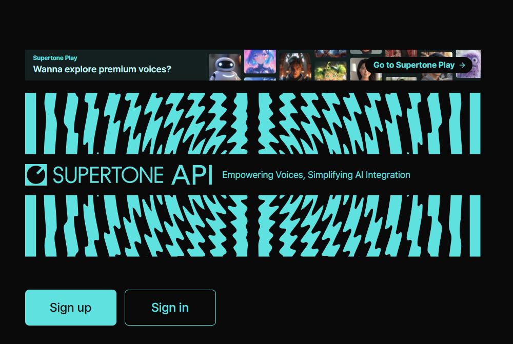
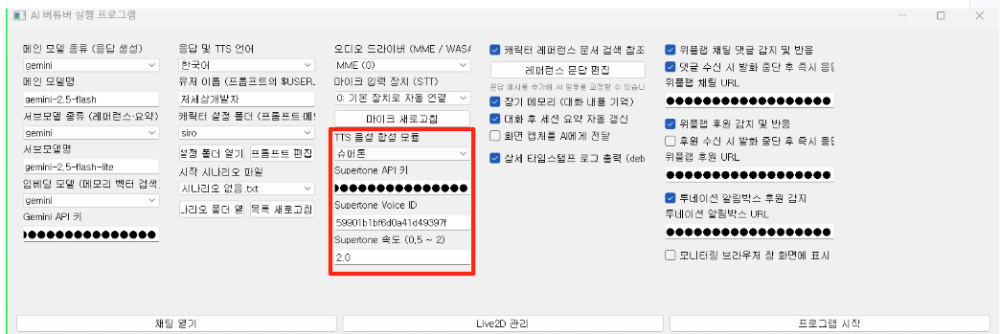
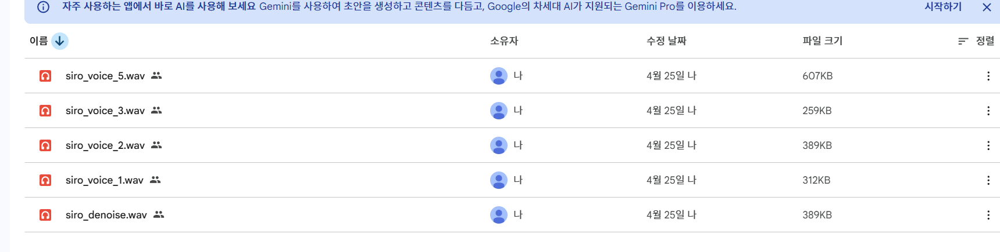
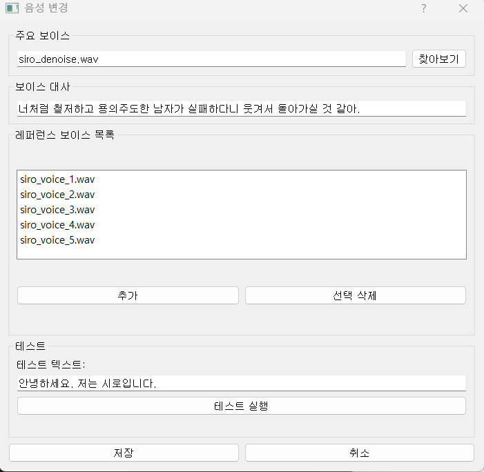
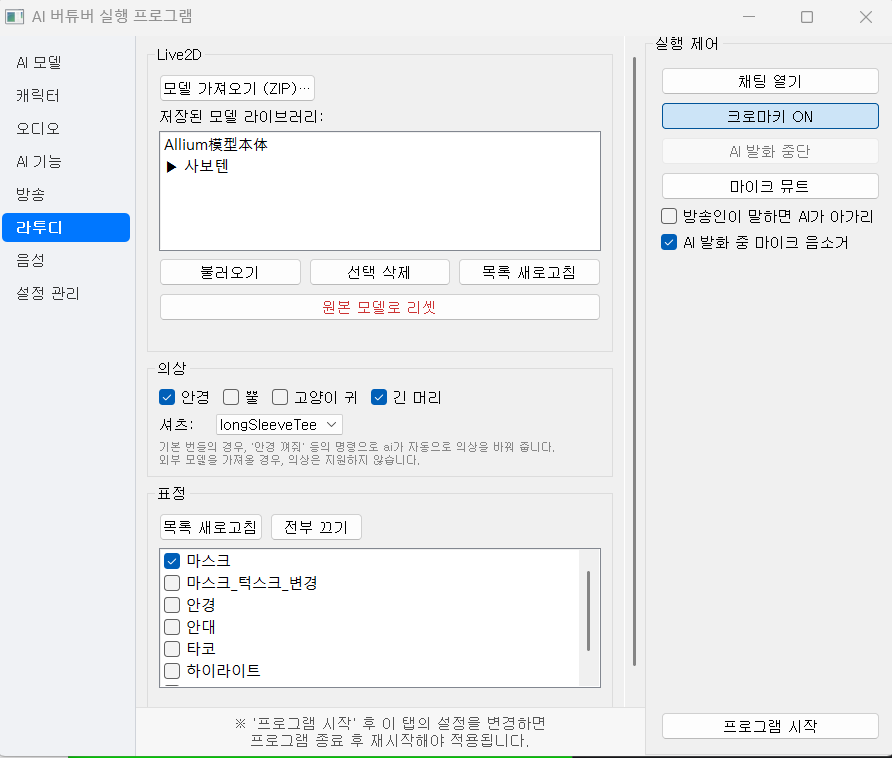
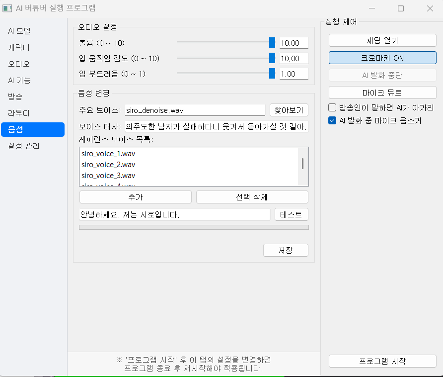

# 02-2. 오디오·Live2D

**오디오·음성** 탭과 **라투디** 탭을 설명합니다.

## 오디오·음성

**오디오·음성** 탭에서 마이크(STT)와 TTS·보이스를 설정합니다.

### 입력 장치

| 항목 | 설명 |
|------|------|
| 오디오 드라이버 | WASAPI 등 호스트 API |
| 마이크 (STT) | 음성 인식에 사용할 입력 장치 |
| 마이크 목록 새로고침 | 장치 연결 후 목록 갱신 |

### STT (음성 인식)

**faster-whisper (로컬)** — PC에서 오프라인 인식 (GPU 권장). 모델이 클수록 정확하지만 느립니다.

**OpenAI Realtime** — OpenAI API 키 필요. 실시간 partial 인식.

프로그램 **시작 전** **STT 테스트**로 마이크·인식 품질을 확인할 수 있습니다.

### TTS (음성 합성)

| 모듈 | 설명 |
|------|------|
| **tts 모듈** | GPT-SoVITS 로컬 서버 (보이스 클론) |
| **Supertone** | 클라우드 TTS (API 키 + 보이스 ID) |
| **MiniMax** | 클라우드 TTS (API 키 + voice_id) |

GPT-SoVITS 최초 로딩 시 딜레이가 있을 수 있습니다. 첫 로딩 후 출력이 없으면 프로그램을 재시작해 보세요.

#### Supertone (선택)

[Supertone Console](https://console.supertoneapi.com/)에서 API 키 발급. [Supertone 결제](https://play.supertone.ai/subscription)에서 과금.

보이스 교체: **음성 변경** 버튼으로 참조 음성을 업로드합니다.

모듈별 **보이스 설정** 패널에서 참조 음성·보조 보이스·재생 볼륨·입 움직임 gain을 조절합니다. 설정은 **자동 저장**됩니다.

### 재시작 필요 항목

- STT 제공자 (Whisper ↔ OpenAI)
- TTS 모듈 종류
- Whisper 모델 크기

## Live2D (라투디)

**라투디** 탭에서 Unity에 표시할 Live2D 모델·표정·의상·재생 설정을 관리합니다.

### 모델

- **모델 업로드** — `.zip` 번들 또는 외부 Cubism 모델
- 업로드 후 Unity 클라이언트에 모델이 전송·로드됩니다

‘Live2D 모델 가져오기 (ZIP)’ → 파일 선택 → **Unity에 업로드**. 휠로 확대/축소, 드래그로 위치 조정.

### 표정·감정

- LLM 응답의 감정 태그에 따라 표정이 바뀝니다
- **감정–표정 매핑** UI에서 감정별 Live2D expression을 연결
- **감정별 추가 프롬프트**는 [[02-1. AI·화면|AI·화면]] 탭에서 편집

### 의상 (Outfit)

- 안경·뿔·고양이 귀 등 토글 가능한 의상 파트
- UI에서 변경하면 디스크·Unity에 즉시 반영
- AI 응답의 `<glasses_on>` 같은 태그로도 변경 가능

### 재생 설정

| 항목 | 설명 |
|------|------|
| 볼륨 | Unity AudioSource 볼륨 |
| Mouth gain | 립싱크 입 움직임 강도 |

### 목소리 변경 (GPT-SoVITS)

한 문장 정도의 음성을 **주요 보이스**로 업로드하고, 같은 목소리의 다른 대사를 **레퍼런스 보이스**로 추가할 수 있습니다.

Python이 behavior 명령을 WebSocket으로 보내면 Unity가 표정·의상·자막을 갱신합니다. [[01. 시작하기|Unity 클라이언트]]가 실행 중이어야 합니다.

## 실행 제어 연동

| 옵션 | 설명 |
|------|------|
| 방송인이 말하는 동안 AI가 말하지 않음 | STT로 사용자 발화 감지 시 AI TTS 중단 |
| AI 발화 중 마이크 음소거 | AI가 말할 때 STT 입력 일시 중지 |
