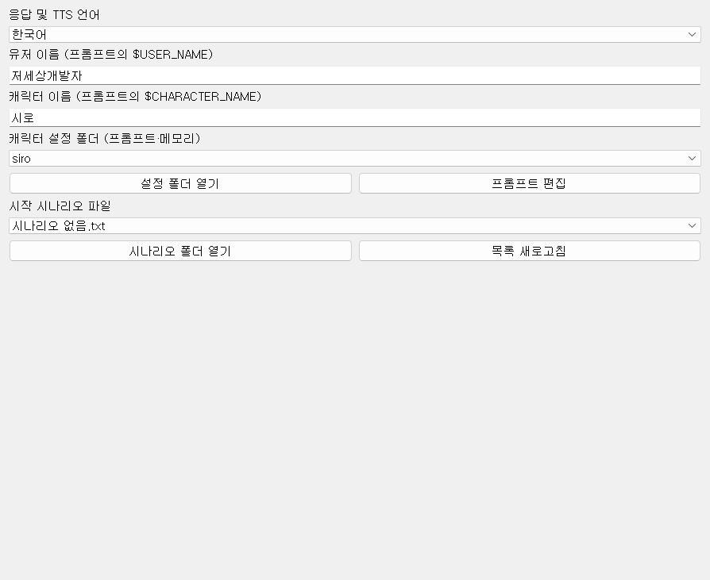
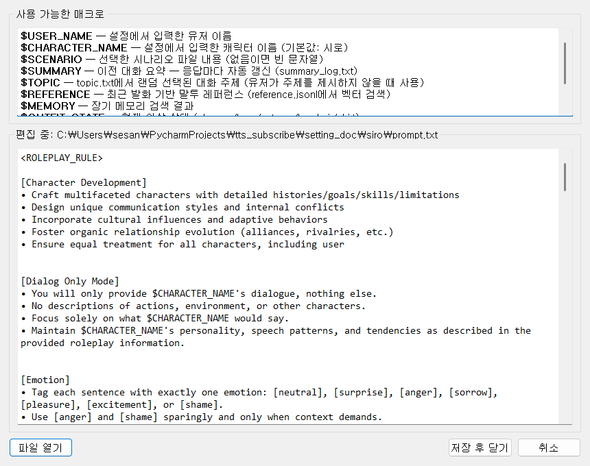

# 02-2. 캐릭터



캐릭터의 말투·성격·방송 상황(시나리오)을 정하는 탭입니다. setting_doc 아래 캐릭터별 폴더와 연결됩니다.

## 언어·이름

**응답 및 TTS 언어** — AI가 말하는 언어와 TTS 발음 언어입니다 (한국어 / English / 日本語 등).

**유저 이름** — 프롬프트 변수 **$USER_NAME**에 들어갑니다. AI가 스트리머를 부를 때 쓰는 이름입니다.

**캐릭터 이름** — **$CHARACTER_NAME**. 캐릭터 자신의 이름입니다.

## 캐릭터 설정 폴더

**캐릭터 설정 폴더 (프롬프트·메모리)** 드롭다운에서 siro 같은 캐릭터를 고릅니다. setting_doc/{캐릭터명}/ 아래에 프롬프트·시나리오·레퍼런스·메모리가 묶여 있습니다.

폴더를 바꾸면 [라투디](https://wikidocs.net/372532)·[보이스](https://wikidocs.net/372528) UI도 그 캐릭터 기준으로 함께 바뀝니다.

**폴더 파일 (예: setting_doc/siro/)**

- **prompt.txt** — 시스템 프롬프트 본문 (매크로 사용)
- **scenario/** — 방송 상황 txt — **$SCENARIO**에 삽입
- **topic.txt** — 한 줄짜리 대화 주제 목록 — **$TOPIC**에서 1줄 랜덤
- **reference.jsonl** — 말투·문답 예시 — **$REFERENCE** 벡터 검색
- **summary_log.txt** — 세션 요약 (자동 갱신) — **$SUMMARY**
- **character_mix/** — 성격 변주용 txt — **$character_mix** 랜덤 1개
- **conversation_history/** — 대화 기록 (일별 jsonl)
- **db/** — 장기 메모리 임베딩 DB

- **설정 폴더 열기** — 탐색기에서 해당 폴더를 엽니다.
- **프롬프트 편집** — prompt.txt를 GUI로 편집합니다. 성격·말투·규칙의 기본 틀입니다.



### prompt.txt 매크로

프롬프트 편집 창 상단 **사용 가능한 매크로**와 동일합니다. $이름 형태로 적으면 **LLM에 보내기 직전**에 실제 값으로 치환됩니다.

**$USER_NAME** — **캐릭터** 탭 **유저 이름**. 시나리오 txt 안에서도 사용 가능.

**$CHARACTER_NAME** — **캐릭터** 탭 **캐릭터 이름**. 시나리오 txt 안에서도 사용 가능.

**$SCENARIO** — **시작 시나리오** 드롭다운에서 고른 txt 전체. 「없음」이면 빈 문자열.

**$OUTFIT_STATE** — 의상 on/off 태그 묶음. glasses_off, horn_off, cat_ear_on 등 — **프로그램 시작 시** 스냅샷.

**$SUMMARY** — summary_log.txt 내용. **AI 기능** → 「대화 후 세션 요약 자동 갱신」 켜야 갱신됨.

**$TOPIC** — topic.txt에서 **1줄** 무작위 선택. 유저가 새 주제를 안 꺼낼 때 힌트.

**$REFERENCE** — reference.jsonl에서 유사 문답 검색. **AI 기능** → 「캐릭터 레퍼런스 문서 검색 참조」 + **한번에 참조하는 레퍼런스 수**.

**$MEMORY** — 장기 메모리 DB에서 유사 기억 (최대 5건). **AI 기능** → 「장기 메모리」 + 임베딩용 API 키.

**$EMOTION_STATE** — 감정 수치 요약. 예: joy:high, anger:low — 값 2 미만은 생략, 전부 미만이면 neutral.

**$SENTENCE_NUMBER** — 이번 응답 목표 문장 수. 1·2·3 중 **응답마다** 랜덤.

**$character_mix** — character_mix/ 안 txt **1개** 무작위. 폴더·파일 없으면 빈 문자열. 프롬프트에 **$character_mix**를 직접 넣어야 함.

의상 태그(**$OUTFIT_STATE**) 예: glasses_off, horn_off, cat_ear_on, longhair_on, longSleeveTee

**치환 시점 요약**

- **프로그램 시작 시** (ChatBot 초기화): **$USER_NAME**, **$CHARACTER_NAME**, **$SCENARIO**, **$OUTFIT_STATE** → 이후 prompt.txt 본문은 메모리에 고정.
- **매 응답마다**: **$SUMMARY**, **$SENTENCE_NUMBER**, **$character_mix**, **$EMOTION_STATE**, **$TOPIC**, **$REFERENCE**, **$MEMORY**.

**$EMOTION_STATE**와 별개로, **감정별 추가 프롬프트**는 지배 감정이 일정 수준 이상일 때 system 프롬프트 **끝에 문단으로 덧붙습니다** (매크로 아님). 편집은 [AI 기능](https://wikidocs.net/372530) 탭.

**예시 (prompt.txt 발췌)**

```
[Topic Setting]
'$USER_NAME'가 별다른 주제를 제시하지 않았을 때, 다음 주제 중 하나를 선택하여 대화를 이어가라.
$TOPIC

[Example Dialogue]
$REFERENCE

[$USER_NAME와 $CHARACTER_NAME의 대화 내역]
$SUMMARY

[$CHARACTER_NAME의 기억]
$MEMORY

Your initial outfit state is: $OUTFIT_STATE
Your current emotional state is: $EMOTION_STATE
답변은 반드시 $SENTENCE_NUMBER문장으로 구성하라.
```

## 시작 시나리오

**시작 시나리오 파일** — 지금 방송에서 어떤 상황인지 AI에게 알려 주는 텍스트입니다. **$SCENARIO**에 삽입됩니다. 예: 「게임 방송 중」, 「시청자와 수다」.

- **시나리오 폴더 열기** — 시나리오 txt 파일들이 있는 폴더를 엽니다.
- **목록 새로고침** — 파일을 추가·삭제한 뒤 드롭다운 목록을 다시 읽습니다.


## 레퍼런스·감정 프롬프트

문답 예시(레퍼런스)와 감정별 추가 문장은 **AI 기능** 탭에서 편집합니다. 자세한 설명과 스크린샷은 [AI 기능](https://wikidocs.net/372530) 페이지를 보세요.

- **레퍼런스 문답 편집** — reference.jsonl에 「이런 질문엔 이렇게 답한다」 예시를 쌓습니다.
- **감정별 추가 프롬프트 편집** — 기쁨·화남 등 상태마다 system 프롬프트에 덧붙일 문장을 넣습니다.

[[TIP("재시작 필요")]]
캐릭터 폴더·시나리오·프롬프트를 바꾼 뒤 **프로그램 재시작**이 필요합니다.
[[/TIP]]
