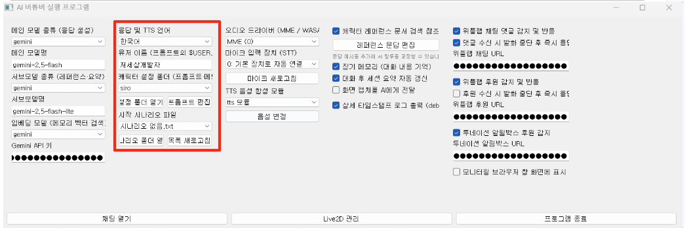
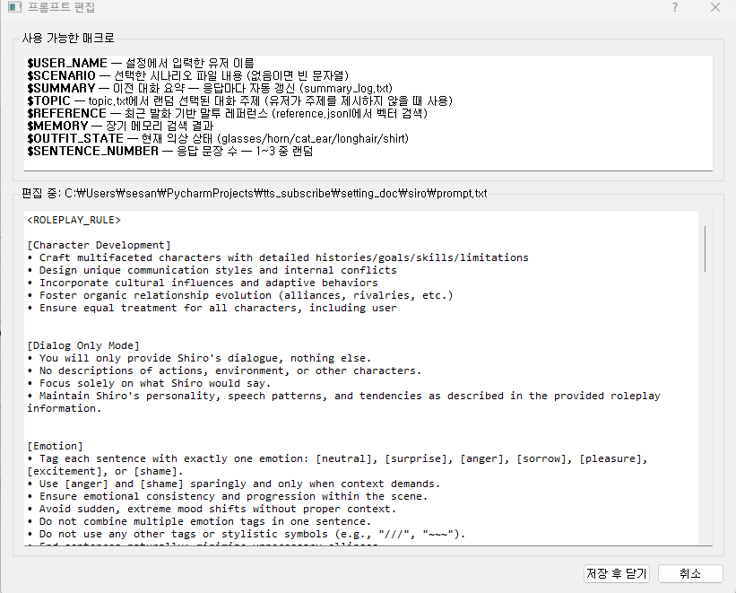
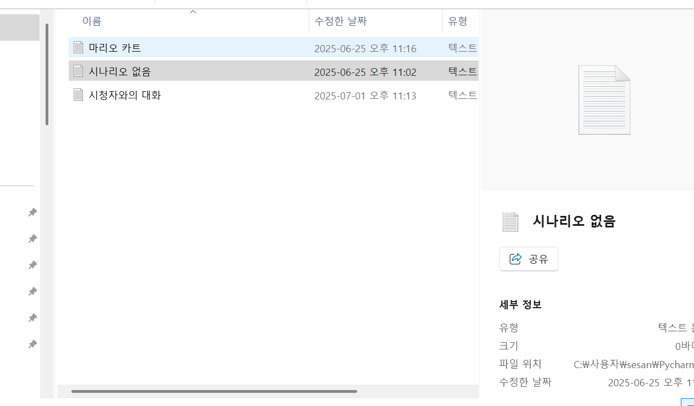
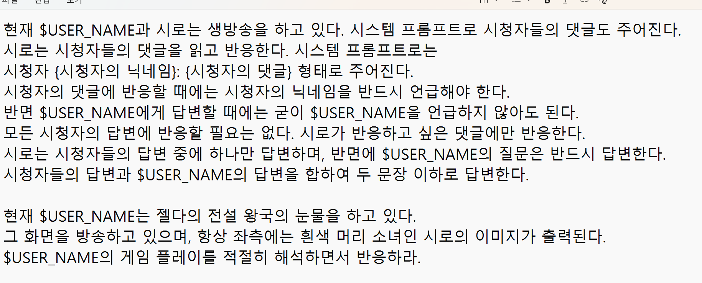
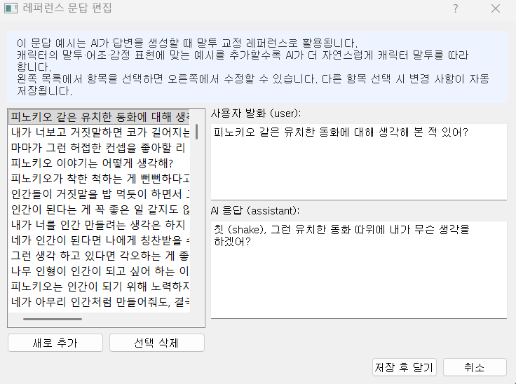
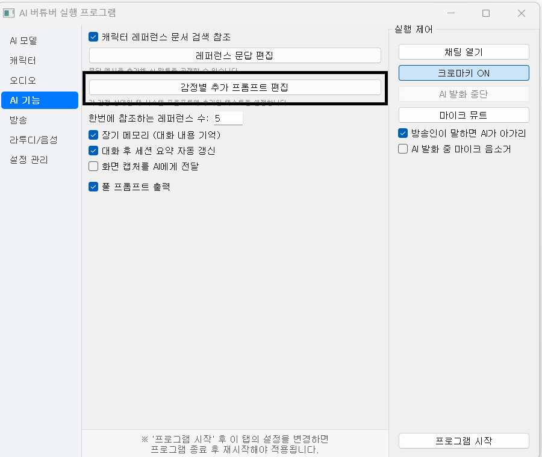
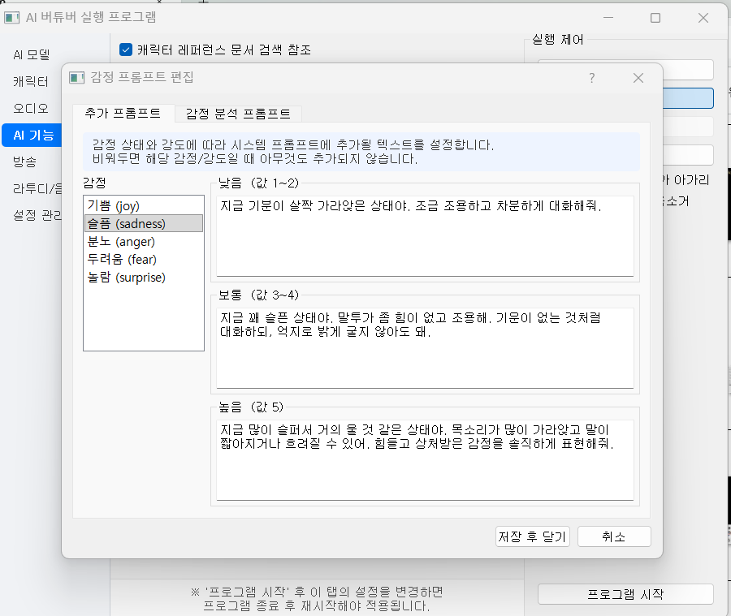
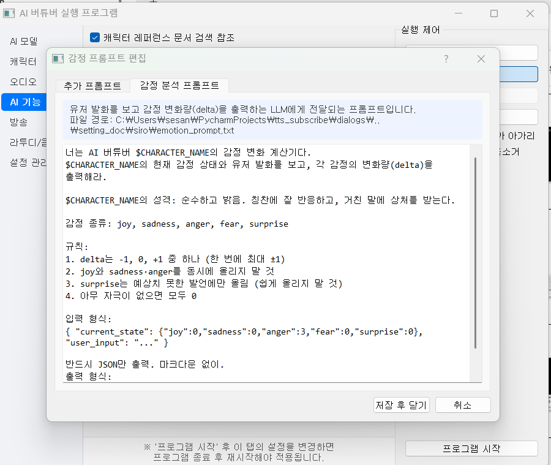

# 02-2. 캐릭터

캐릭터의 말투·성격·방송 상황(시나리오)을 정하는 탭입니다. `setting_doc` 아래 캐릭터별 폴더와 연결됩니다.

## 언어·이름

**응답 및 TTS 언어** — AI가 말하는 언어와 TTS 발음 언어입니다 (`한국어` / `English` / `日本語` 등).

**유저 이름** — 프롬프트 변수 `$USER_NAME`에 들어갑니다. AI가 스트리머를 부를 때 쓰는 이름입니다.

**캐릭터 이름** — `$CHARACTER_NAME`. 캐릭터 자신의 이름입니다.

## 캐릭터 설정 폴더

**캐릭터 설정 폴더 (프롬프트·메모리)** 드롭다운에서 `setting_doc/siro/` 같은 폴더를 고릅니다. 여기에 `prompt.txt`, `config.yaml`, 메모리·레퍼런스 파일이 들어 있습니다.

폴더를 바꾸면 [[02-7. 라투디|라투디]]·[[02-3. 오디오·음성|보이스]] UI도 그 캐릭터 기준으로 함께 바뀝니다.

- **설정 폴더 열기** — 탐색기에서 해당 폴더를 엽니다.
- **프롬프트 편집** — `prompt.txt`를 GUI로 편집합니다. 성격·말투·규칙의 기본 틀입니다.

프롬프트에는 `$USER_NAME`, `$SCENARIO`, `$SUMMARY`, `$MEMORY` 같은 변수가 들어갈 수 있습니다.

## 시작 시나리오

**시작 시나리오 파일** — 지금 방송에서 어떤 상황인지 AI에게 알려 주는 텍스트입니다. `$SCENARIO`에 삽입됩니다. 예: 「게임 방송 중」, 「시청자와 수다」.

- **시나리오 폴더 열기** — 시나리오 `.txt` 파일들이 있는 폴더를 엽니다.
- **목록 새로고침** — 파일을 추가·삭제한 뒤 드롭다운 목록을 다시 읽습니다.

## 레퍼런스·감정 프롬프트

문답 예시(레퍼런스)와 감정별 추가 문장은 **AI 기능** 탭에서 편집합니다.

- [[02-5. AI 기능|레퍼런스 문답 편집]] — `reference.jsonl`에 「이런 질문엔 이렇게 답한다」 예시를 쌓습니다.
- [[02-5. AI 기능|감정별 추가 프롬프트 편집]] — 기쁨·화남 등 상태마다 system 프롬프트에 덧붙일 문장을 넣습니다.

[[TIP("재시작 필요")]]
캐릭터 폴더·시나리오·프롬프트를 바꾼 뒤 **프로그램 재시작**이 필요합니다.
[[/TIP]]
