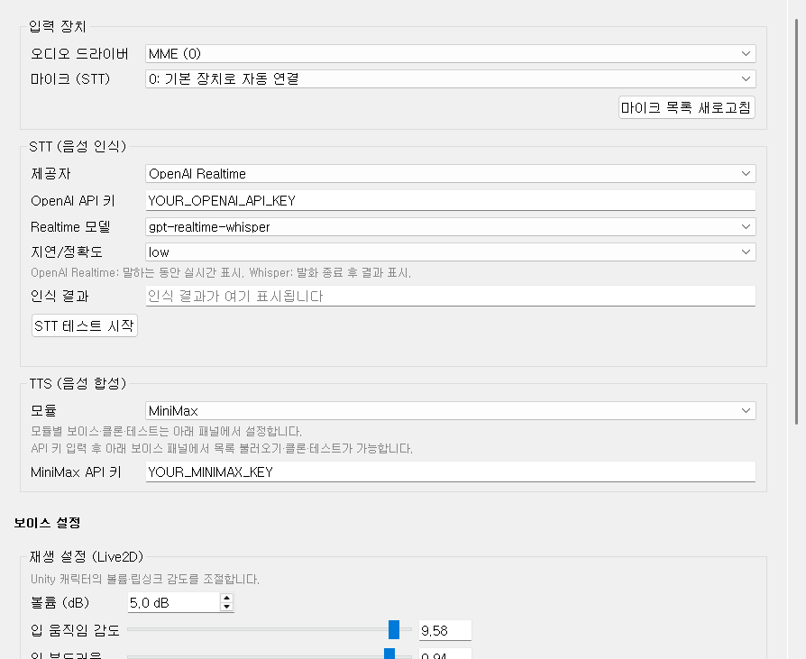
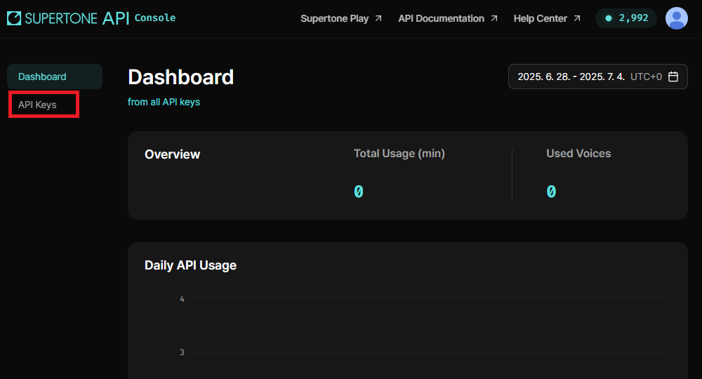
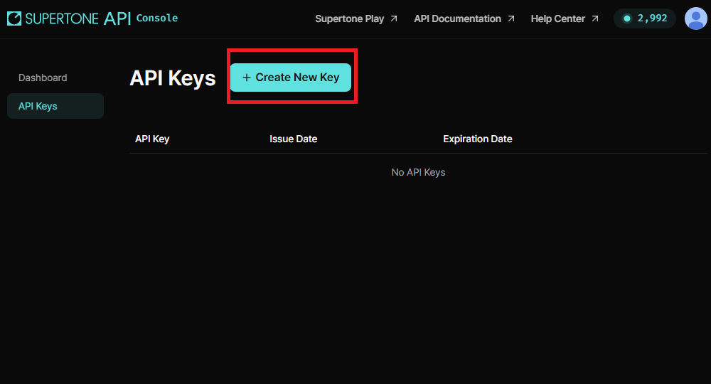
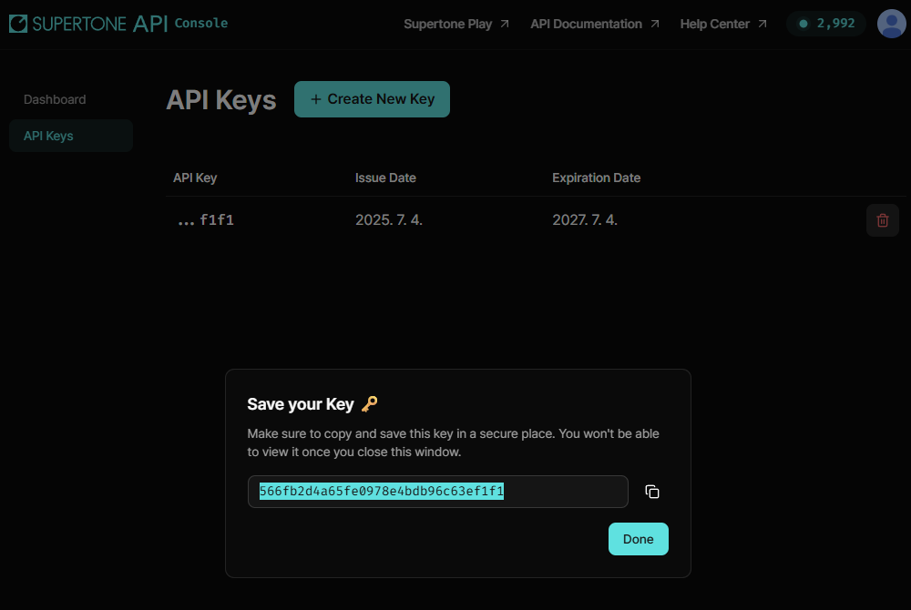
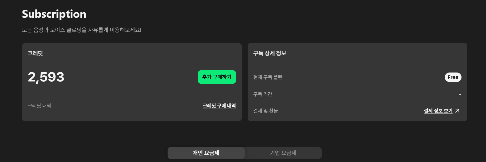
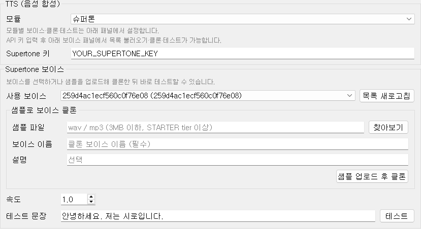
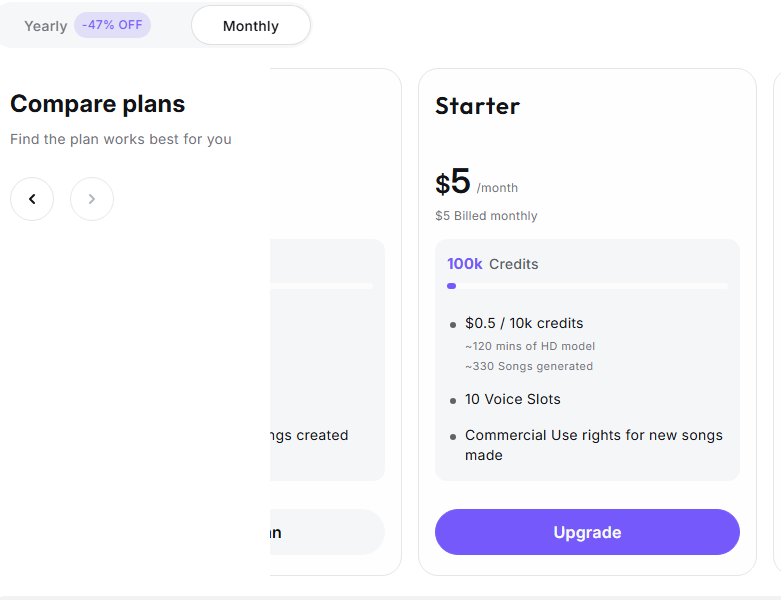
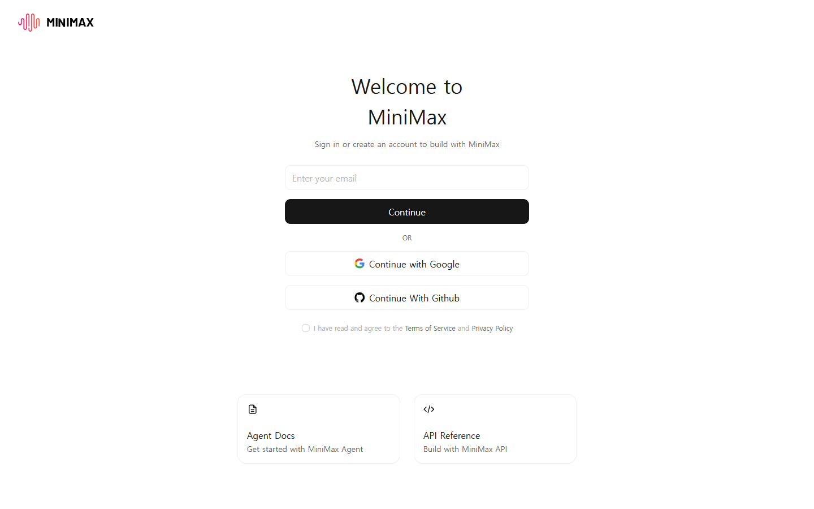
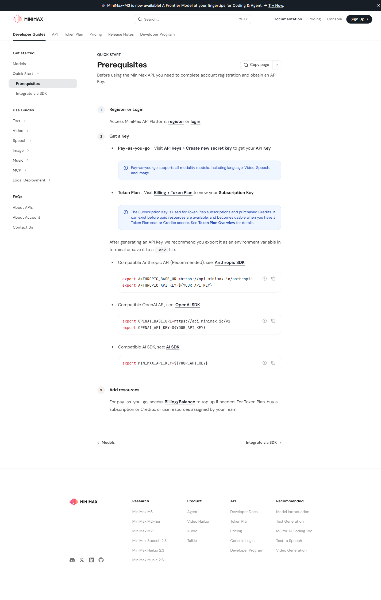
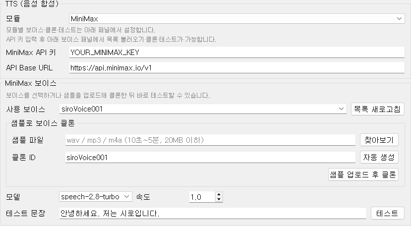

# 02-3. 오디오·음성

마이크 입력(STT), AI 목소리(TTS), Live2D 립싱크까지 한 탭에서 설정합니다.

## 권장 구성

| | **방송·스트리밍** | **집에서 써보기·연습** |
|--|-------------------|------------------------|
| **STT** | **OpenAI Realtime** | **faster-whisper (로컬)** |
| **TTS** | **MiniMax** | **tts 모듈** (GPT-SoVITS) |
| **비용** | OpenAI·MiniMax API 사용량 (유료) | STT/TTS API **무료** (LLM API는 별도) |
| **특징** | 말하는 중에도 글자가 올라오고, TTS 지연·품질이 방송에 유리 | NVIDIA GPU로 로컬 처리. 설정은 단순하지만 GPU·VRAM 부담 |

[[TIP("스트리머")]]
설정 항목이 많아도 **Realtime STT + MiniMax TTS** 조합을 권장합니다. 방송 중 GPU를 SoVITS·Whisper에 쓰지 않아도 되고, 인식·합성 반응이 빠릅니다. 이어폰·「AI 발화 중 마이크 음소거」로 에코를 줄이세요.
[[/TIP]]

[[TIP("일반 유저")]]
돈 들이지 않고 써보려면 **Whisper + GPT-SoVITS(`tts 모듈`)** 만 켜면 됩니다. LLM(Gemini 등) API 키만 있으면 STT/TTS 추가 과금 없이 동작합니다.
[[/TIP]]

## 입력 장치

**오디오 드라이버** — Windows에서는 보통 WASAPI를 씁니다. 장치가 안 보이면 다른 항목을 시도해 보세요.

**마이크 (STT)** — 음성 인식에 쓸 마이크를 고릅니다. 이어폰·USB 마이크 연결 후 **마이크 목록 새로고침**을 눌러 목록을 갱신하세요.

마이크 목록만은 프로그램 실행 중에도 새로고침할 수 있습니다.

## STT (음성 인식)

마이크로 들어온 소리를 텍스트로 바꿉니다. **방송 → OpenAI Realtime**, **무료 로컬 → faster-whisper** (위 **권장 구성** 표 참고).

**제공자**

- **faster-whisper (로컬)** — PC에서 Whisper 모델을 돌립니다. API 비용 없음, NVIDIA GPU 권장. **일반·연습용 1순위.**
- **OpenAI Realtime** — 클라우드 실시간 STT. 말하는 동안 글자가 바로 올라옵니다. **방송·스트리밍용 1순위.**

**Whisper 모델** (로컬 선택 시) — `tiny`부터 `large-v3`까지. 클수록 정확하지만 느리고 VRAM을 더 씁니다. `small` 정도가 무난한 출발점입니다.

**OpenAI Realtime** (클라우드 선택 시)

- **OpenAI API 키** — AI 모델 탭의 OpenAI 키와 연동됩니다.
- **Realtime 모델** — `gpt-realtime-whisper`
- **지연/정확도** — `minimal`~`xhigh`. 낮을수록 빠르고, 높을수록 끝맺음·문장 경계가 정확해집니다.

**STT 테스트 시작** — **프로그램 시작 전**에 마이크가 잘 잡히는지 확인합니다. 버튼을 누르고 말하면 **인식 결과** 칸에 텍스트가 나옵니다.

Whisper는 **말을 멈춘 뒤** 결과가 나오고, Realtime은 **말하는 중**에도 표시됩니다.

## TTS (음성 합성)

AI 대사를 실제 목소리로 만듭니다.

**모듈** — `없음` / `슈퍼톤` / `MiniMax` / `tts 모듈`(GPT-SoVITS 로컬). **방송용은 MiniMax**, **무료 로컬은 `tts 모듈`** 을 권장합니다. 모듈에 따라 TTS 영역과 **보이스 설정** 패널이 바뀝니다.

## Supertone (슈퍼톤)

클라우드 TTS **슈퍼톤**을 쓸 때의 설정입니다. (MiniMax 대안 — 방송용 1순위는 위 **권장 구성**의 MiniMax)

### API 키 발급 (웹)

1. [Supertone API](https://supertoneapi.com/) 접속 → **Sign up** 또는 **Sign in**

2. [Supertone API Console](https://console.supertoneapi.com/) 로그인 → 좌측 **API Keys** 메뉴

3. **+ Create New Key** 클릭

4. **Save your Key** 창에서 키를 **복사**합니다. 창을 닫으면 다시 볼 수 없습니다.

TTS·보이스 클론 사용에는 크레딧이 필요합니다. [Supertone Play — Subscription](https://play.supertone.ai/subscription)에서 크레딧·요금제를 확인·구매할 수 있습니다.

### 프로그램에 입력

1. **오디오·음성** 탭 → **TTS (음성 합성)** → **모듈**에서 **슈퍼톤** 선택
2. **Supertone 키**에 복사한 API 키 붙여넣기
3. **Supertone 보이스** → **목록 새로고침** → 보이스 선택
4. 필요하면 **샘플로 보이스 클론** (wav/mp3, STARTER tier 이상) · **테스트**로 확인

## MiniMax

클라우드 TTS **MiniMax**. **방송·스트리밍용 TTS 1순위**입니다.

### 요금 — 가장 저렴하게 시작하기

TTS 크레딧은 **[MiniMax Audio — Subscription](https://www.minimax.io/audio/subscribe)** 에서 구독하는 것이 보통 가장 쌉니다.

- **Monthly Starter Pack (약 $5/월)** — 소규모 방송·테스트에 무난한 시작점. 위 페이지에서 **Monthly** 선택 후 **Starter** 플랜
- 종량제만 쓸 경우 [Billing — Balance](https://platform.minimax.io/user-center/payment/balance)에서 잔액 충전

Speech API 키는 아래 **API Platform**에서 발급하고, TTS 사용량·구독은 **Audio Subscription** 페이지에서 관리합니다.

### API 키 발급 (웹)

1. [MiniMax API Platform](https://platform.minimax.io/) 접속 → **Sign Up** 또는 **Console** → 로그인 화면

2. Google·GitHub 또는 이메일로 가입·로그인 후 좌측 **API Keys** → **Create new secret key** → 키 이름 입력 후 생성

3. 표시된 **Secret Key**를 즉시 복사합니다 (재표시되지 않음)

4. (선택) 종량제 잔액은 [Billing — Balance](https://platform.minimax.io/user-center/payment/balance)에서 충전합니다. **월 구독 Starter Pack**은 [MiniMax Audio — Subscription](https://www.minimax.io/audio/subscribe)을 권장합니다.

공식 가이드: [MiniMax API — Prerequisites](https://platform.minimax.io/docs/guides/quickstart-preparation)

### 프로그램에 입력

1. **오디오·음성** 탭 → **TTS (음성 합성)** → **모듈**에서 **MiniMax** 선택
2. **MiniMax API 키** 붙여넣기
3. **MiniMax 보이스** → **목록 새로고침** → 보이스 선택
4. **모델**(`speech-2.8-hd` / `speech-2.8-turbo`)·**속도** 조절, **샘플로 보이스 클론**·**테스트** 가능

## GPT-SoVITS (`tts 모듈`)

로컬 GPT-SoVITS TTS입니다. **API 비용 없이** 쓰려면 이 모듈을 선택하세요. 프로그램이 서버를 자동 기동합니다. NVIDIA GPU·VRAM이 필요합니다.

**모듈**에서 **tts 모듈**을 고르면 **GPT-SoVITS 보이스** 패널이 나옵니다.

**주요 보이스** — 참조 wav 파일. **보이스 대사** — 그 wav에 대응하는 텍스트. **보조 보이스** — 감정·톤을 바꿀 때 추가 참조.

## 재생 설정 (Live2D)

캐릭터 **볼륨**, **입 움직임 감도**, **입 부드러움**을 조절합니다. **프로그램 실행 중에도** 슬라이더 변경이 바로 반영됩니다.

## 실행 제어와의 연동

[실행 제어](https://wikidocs.net/372534) 패널의 「방송인이 말하는 동안 AI가 말하지 않음」「AI 발화 중 마이크 음소거」는 STT·TTS 동작과 함께 쓰입니다.

[[TIP("재시작 필요")]]
STT 제공자·Whisper 모델·TTS 모듈·보이스 파일 변경은 **프로그램 재시작** 후 적용됩니다.
[[/TIP]]
