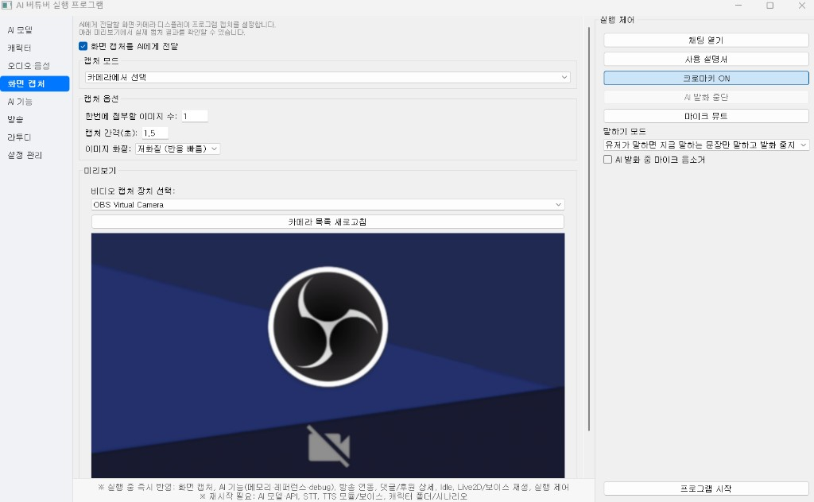
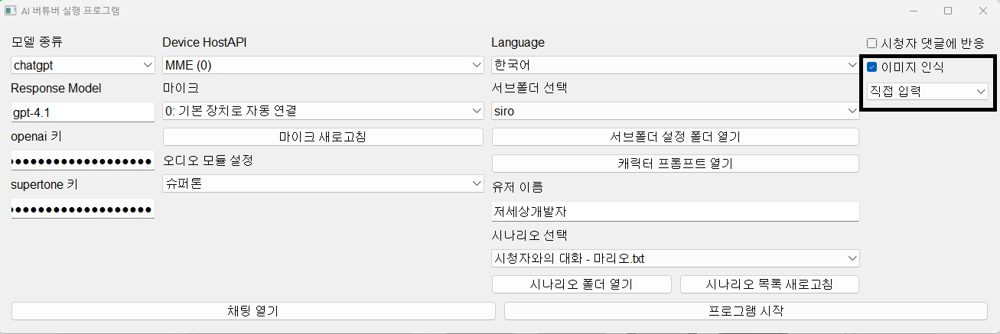
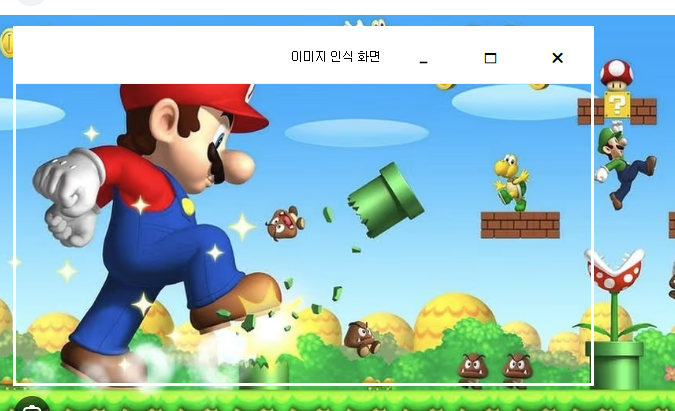
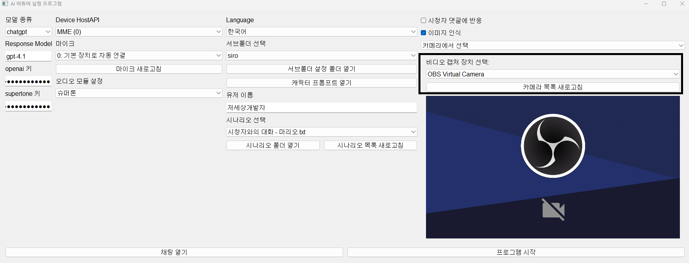
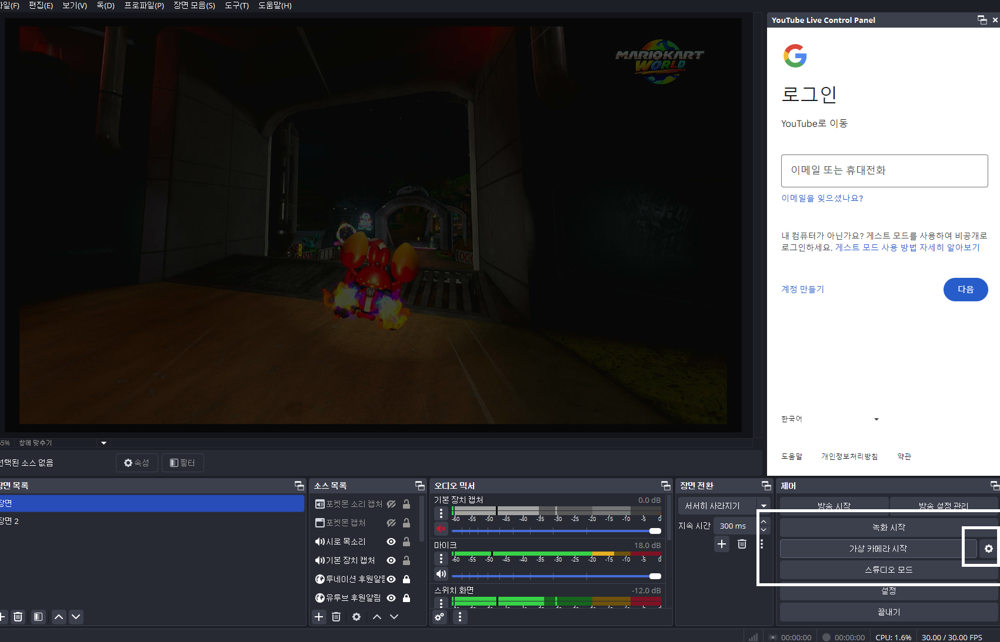
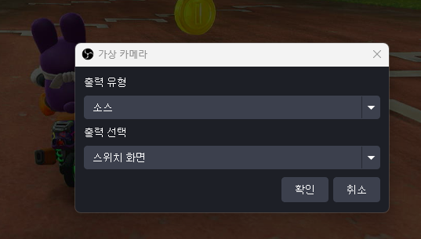
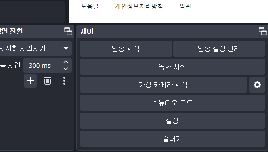
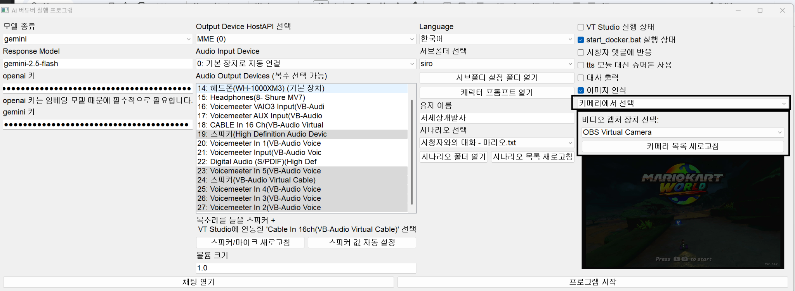

# 02-4. 화면 캡처

게임 화면·카메라·모니터를 캡처해 **멀티모달 LLM**에 함께 보냅니다. 「지금 화면 뭐야?」 같은 질문에 답하게 할 때 씁니다.

## 켜기/끄기

**화면 캡처를 AI에게 전달** — 체크하면 대화 요청마다 캡처 이미지가 LLM에 첨부됩니다. 끄면 텍스트·음성만 사용합니다.

체크하지 않으면 이 옵션만 보이고, 아래 **캡처 모드·옵션·미리보기**는 숨겨집니다. 설정하려면 먼저 켜 주세요.

[[TIP("TIP")]]
**캡처 모드**는 **카메라에서 선택**을 권장합니다. OBS **가상 카메라**로 게임·방송 화면을 넘기면, 프로그램·디스플레이 캡처에서 나오는 **검은 화면**을 피하기 쉽습니다. (아래 OBS Virtual Camera 절차 참고)
[[/TIP]]

## 캡처 모드

**캡처 모드** — 어디서 그림을 가져올지 고릅니다.

| 모드 | 용도 |
|------|------|
| 직접 입력 | 화면 위 투명 영역(오버레이)으로 임의 구역 지정 |
| 카메라에서 선택 | 웹캠·OBS Virtual Camera |
| 디스플레이 선택 | 모니터 전체 |
| 프로그램 선택 | 특정 창(게임·앱) |

**캡처 대상** — 모드에 맞는 모니터·창·카메라를 선택합니다. 장치를 바꿨으면 **목록 새로고침**을 누르세요.

### 직접 입력 모드

「직접 입력」을 고른 뒤 **캡처 영역 표시**로 오버레이 창을 띄우고, 게임 화면 등에 맞게 영역을 드래그합니다. 투명 사각형 안만 캡처됩니다.

### OBS Virtual Camera

웹캠이 다른 프로그램에 점유되어 있으면 OBS **가상 카메라**를 만들어 **카메라에서 선택** 모드에서 고를 수 있습니다.

비디오 장치 로딩 오류가 나면 Windows **Unicode UTF-8** 베타 옵션을 확인하세요. [UTF-8 로캘 설정 (네이버 블로그)](https://blog.naver.com/404errorkr/223834100569)

일부 GPU 가속 게임·원격 플레이는 **검은 화면**만 나올 수 있습니다. 그때는 OBS로 캡처 후 가상 카메라를 쓰는 편이 낫습니다.

## 캡처 옵션

**한번에 첨부할 이미지 수** — 한 번의 대화에 연속 프레임을 몇 장 보낼지. 4장이면 대략 6초 분량의 흐름을 AI가 볼 수 있습니다.

**캡처 간격(초)** — 여러 장일 때 프레임 사이 간격.

**이미지 화질** — 저화질은 빠르고 API 부담이 적고, 고화질은 디테일을 더 잘 전달합니다.

## 미리보기

하단 **미리보기**에서 실제 캡처 결과를 확인합니다. 영역·모드가 맞는지 방송 전에 꼭 한 번 봐 두세요.

설정 변경은 **프로그램 실행 중에도 즉시 반영**됩니다.
