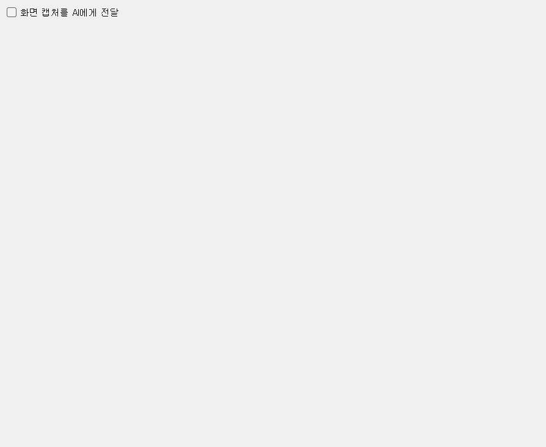
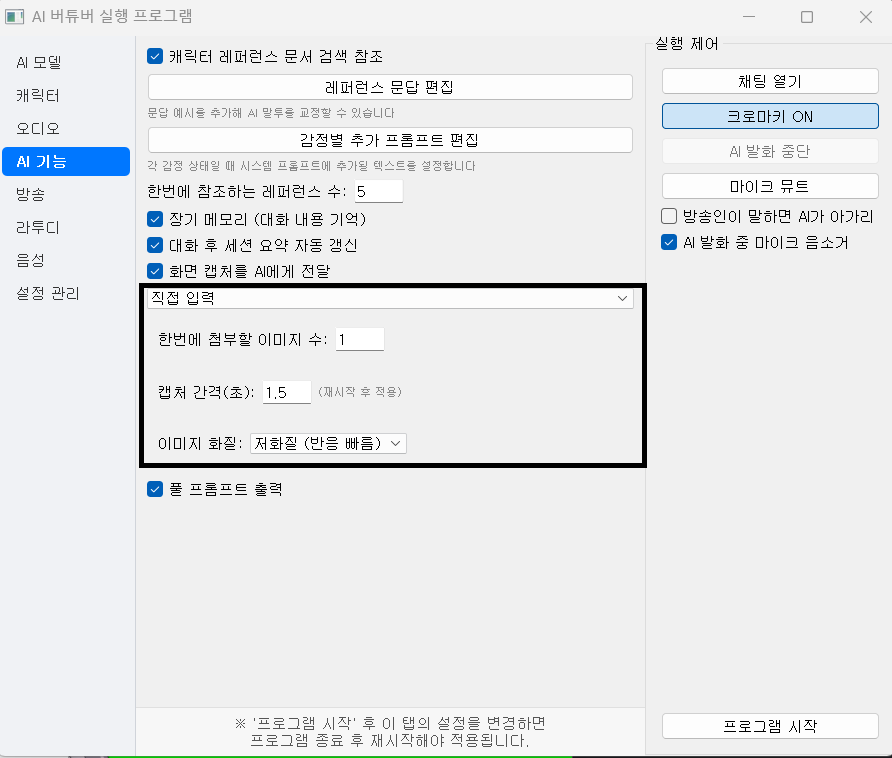

# 02-4. 화면 캡처

| UI 라벨 | 설명 | 즉시 반영 |
|---------|------|-----------|
| 화면 캡처를 AI에게 전달 | 멀티모달 LLM에 이미지 포함 | O |
| 캡처 모드 | 직접 입력 / 카메라 / 디스플레이 / 프로그램 | O |
| 캡처 대상 | 모니터·창·카메라 선택 | O |
| 캡처 영역 표시 | 직접 입력 오버레이 표시 | O |
| 한번에 첨부할 이미지 수 | 연속 프레임 장수 (4장 ≈ 6초) | O |
| 캡처 간격(초) | 프레임 간격 | O |
| 이미지 화질 | 저화질=빠름, 고화질=정확 | O |
| 미리보기 | 실시간 캡처 확인 | O |

[[TIP("TIP")]]
이미지 인식을 켜면 LLM 과금·레이턴시가 증가합니다. 계속 대화 시 시간당 약 $1 수준입니다.
[[/TIP]]

### 직접 입력 모드

1. **직접 입력** 모드 선택 → **캡처 영역 표시**
2. 게임 화면 등에 영역을 드래그해 맞춥니다.

### OBS Virtual Camera

카메라 점유 충돌 시 OBS 가상 카메라를 사용합니다.

[UTF-8 로캘 설정 (네이버 블로그)](https://blog.naver.com/404errorkr/223834100569) — 비디오 장치 로딩 오류 시 **Unicode UTF-8** 베타 옵션 확인.

설정 변경은 **프로그램 실행 중에도 즉시 반영**됩니다.
