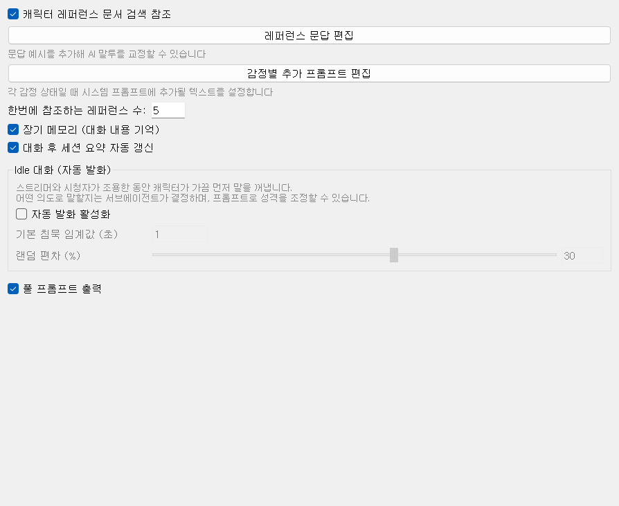

# 02-5. AI 기능

대화 품질·기억·침묵 시 자동 발화 등 AI 동작 방식을 다룹니다. 여기서 바꾼 값은 대부분 **실행 중에도 바로** 저장·반영됩니다.

## 레퍼런스 (말투 교정)

**캐릭터 레퍼런스 문서 검색 참조** — 켜 두면 `reference.jsonl`에서 비슷한 Q&A를 찾아 프롬프트에 끼워 넣습니다. 캐릭터 말투를 예시로 가르칠 때 유용합니다.

**레퍼런스 문답 편집** — 문답 예시를 추가·수정하는 편집기를 엽니다. 「문답 예시를 추가해 AI 말투를 교정할 수 있습니다」

**한번에 참조하는 레퍼런스 수** — 한 번에 가져올 예시 개수 (기본 5). 너무 크면 프롬프트가 길어지고, 너무 작으면 말투 반영이 약해집니다.

## 감정별 추가 프롬프트

**감정별 추가 프롬프트 편집** — 기쁨·슬픔·화남 등 **감정 상태마다** system 프롬프트에 덧붙일 문장을 설정합니다. LLM이 `<happy>` 같은 태그를 쓸 때 함께 적용됩니다.

표정 연결은 [라투디](https://wikidocs.net/372532)의 **감정→표정 매핑**과 짝을 이룹니다.

## 장기 메모리·요약

**장기 메모리 (대화 내용 기억)** — mem0 + Qdrant로 과거 대화를 기억합니다. `localhost:6333`에서 Qdrant가 떠 있어야 합니다. 문제가 있으면 [문제 해결](https://wikidocs.net/372522)을 보세요.

**대화 후 세션 요약 자동 갱신** — 대화가 끝날 때 `$SUMMARY`를 짧게 갱신해, 다음 턴에서 「지금까지 무슨 얘기했는지」 맥락을 유지합니다.

## Idle 대화 (자동 발화)

스트리머와 시청자가 **조용한 동안** 캐릭터가 가끔 먼저 말을 꺼냅니다. 무슨 주제로 말할지는 서브모델(서브에이전트)이 정합니다.

**자동 발화 활성화** — Idle 기능 전체 on/off.

**기본 침묵 임계값 (초)** — 이 시간 동안 아무도 말하지 않으면 발화 후보가 됩니다 (기본 60초).

**랜덤 편차 (%)** — 임계값에 난수를 더해 매번 같은 초에 말하지 않게 합니다.

다음 경우에는 Idle이 **나오지 않습니다**: AI가 이미 말하는 중, 마이크로 사람 발화가 감지됨, 대기 중인 댓글·후원이 있음.

## 디버그

**풀 프롬프트 출력** — `debug` 로그에 LLM에 보낸 전체 system/user 프롬프트를 출력합니다. 말투·변수 치환이 이상할 때 확인용입니다.
