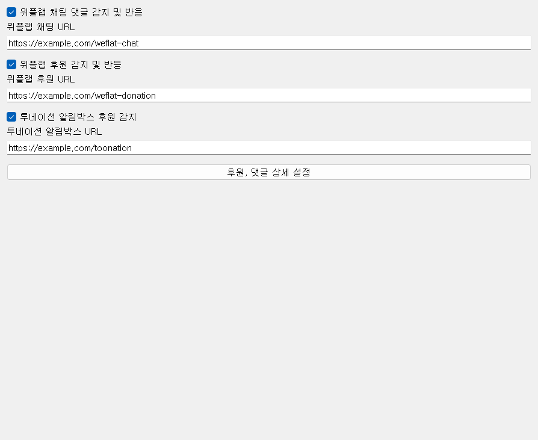
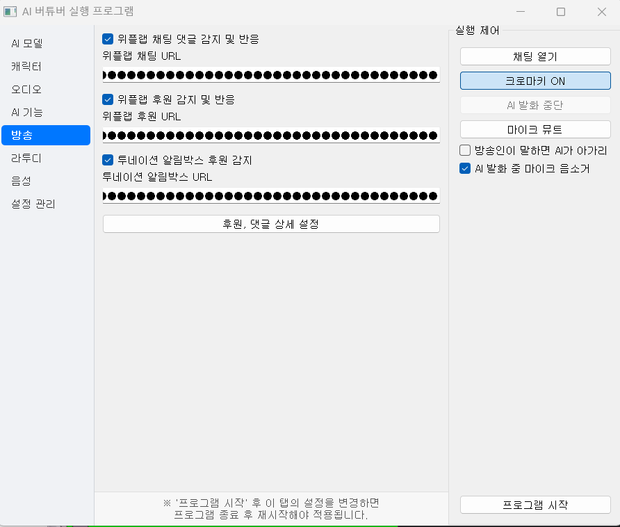
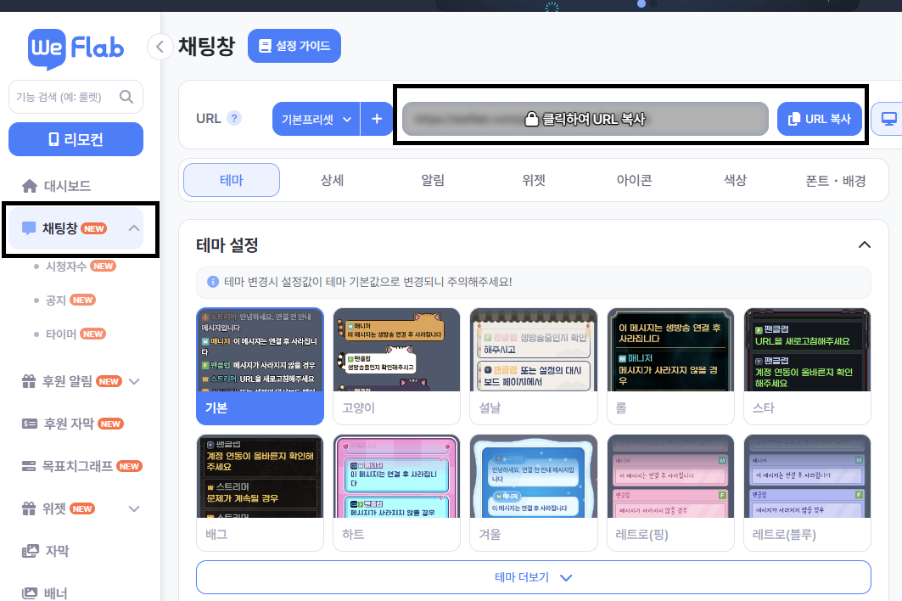
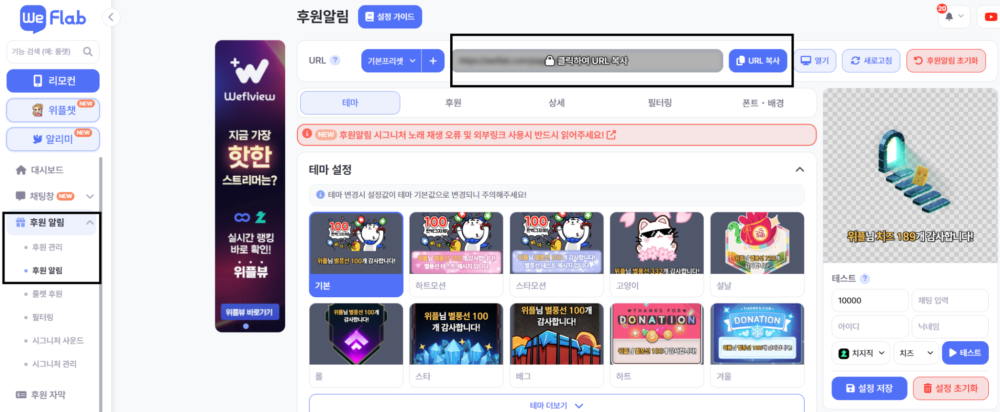
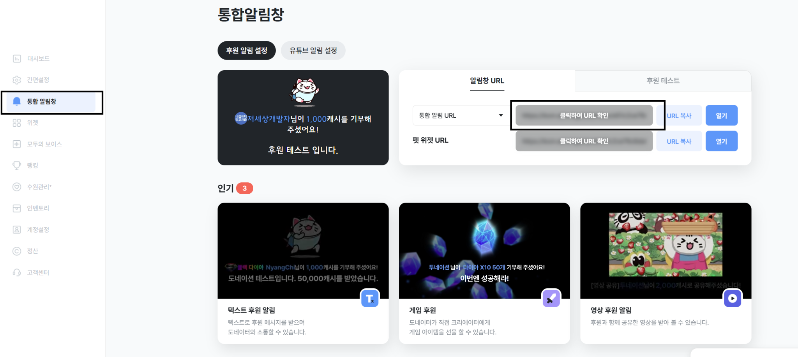
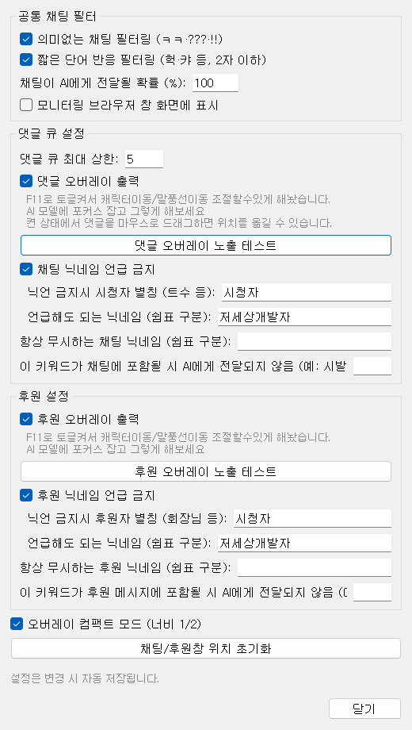

# 02-6. 방송

위플랩 채팅·후원, 투네이션 알림을 받아 AI가 반응하게 합니다. 설정은 **실행 중에도** 저장·반영됩니다.

## 위플랩 채팅

**위플랩 채팅 댓글 감지 및 반응** — 체크하면 위플랩 채팅 오버레이 URL을 모니터링하고, 새 댓글이 오면 AI 응답 큐에 넣습니다.

**위플랩 채팅 URL** — [위플랩 채팅](https://weflab.com/chat)에서 **채팅창 → URL**을 복사해 붙입니다.

채팅 반응용 **시나리오**는 [캐릭터](https://wikidocs.net/372527) 탭에서 고릅니다.

**동작 요약**

- AI가 말하는 중 — 댓글은 **큐에 쌓였다가** TTS가 끝난 뒤 처리됩니다.
- 스트리머가 마이크로 말하는 중(VAD) — 댓글 처리를 **건너뜁니다**.
- 후원이 동시에 있으면 후원이 **누적 댓글보다 우선**합니다.

## 위플랩 후원

**위플랩 후원 감지 및 반응** — 후원 오버레이를 모니터링합니다.

**위플랩 후원 URL** — 위플랩 후원 페이지에서 URL을 복사합니다.

## 투네이션

**투네이션 알림박스 후원 감지** — 투네이션 알림박스 URL을 읽습니다.

**투네이션 알림박스 URL** — 알림박스에 표시된 URL을 입력합니다.

## 후원, 댓글 상세 설정

**후원, 댓글 상세 설정** 버튼으로 필터·큐·오버레이 옵션 다이얼로그를 엽니다.

### 공통 채팅 필터

- **의미없는 채팅 필터링** — ㅋㅋ·???·!! 같은 반복만 있는 메시지 제외
- **짧은 단어 반응 필터링** — 「헉」「캬」 등 2자 이하 단독 메시지 제외
- **채팅이 AI에게 전달될 확률 (%)** — 100% 미만이면 일부 댓글만 무작위로 반응 (부하·비용 조절)
- **모니터링 브라우저 창 화면에 표시** — Playwright 창을 띄워 디버그 (`show_browser`)

### 댓글 큐·오버레이

- **댓글 큐 최대 상한** — 한 번에 AI에게 넘길 댓글 개수 상한
- **댓글 오버레이 출력** — Live2D 말풍선에 채팅 표시. F11로 캐릭터·말풍선 위치 조절 모드 전환 가능
- **댓글 오버레이 노출 테스트** — **프로그램 시작** 후 샘플 채팅을 화면에 표시
- **채팅 닉네임 언급 금지** — AI가 시청자 닉네임을 직접 부르지 않게 함. 대신 「트수」 같은 별칭 사용
- **항상 무시하는 채팅 닉네임** · **차단 키워드** — 스팸·금지어 필터

### 후원 설정

- **후원 오버레이 출력** · **후원 오버레이 노출 테스트**
- **후원 닉네임 언급 금지** — 후원자 닉 대신 「회장님」 등 별칭
- 후원 쪽도 차단 닉네임·키워드 설정 가능

## 자막과 오버레이

| 요소 | 화면에 나오는 것 |
|------|------------------|
| **자막** | AI가 **지금 말하는 대사** (TTS와 동기) |
| **오버레이** | **시청자 채팅·후원** 말풍선 |

AI가 댓글/후원에 **응답하기 시작할 때** 화면에 overlay 이벤트가 표시됩니다. OBS 창 캡처 시 자막·오버레이가 함께 녹화됩니다.

문제가 있으면 [문제 해결](https://wikidocs.net/372522)의 댓글/후원 항목을 참고하세요.
