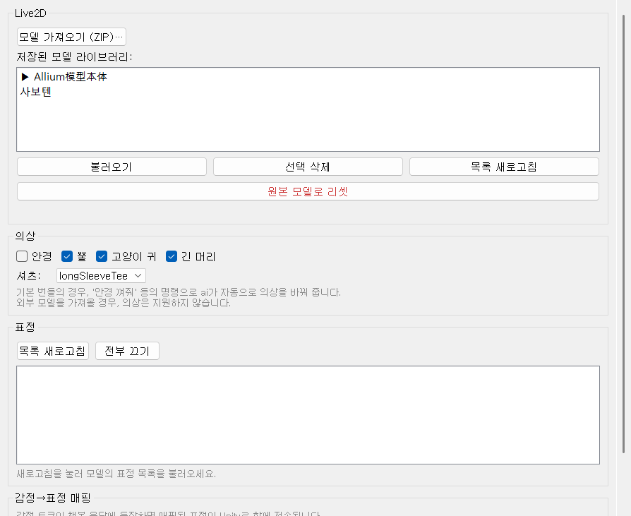
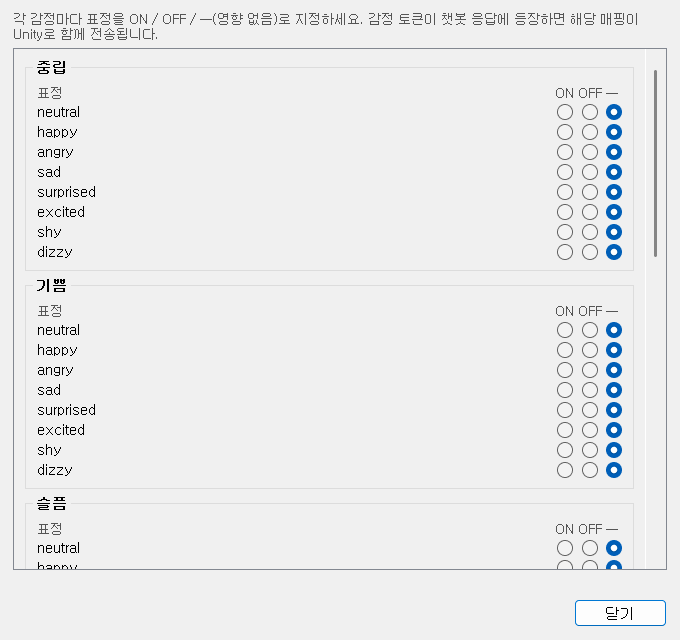

# 02-7. 라투디

Live2D 모델·의상·표정과 TTS 립싱크를 Unity와 맞춥니다. Unity 클라이언트가 **먼저** 떠 있어야 합니다.

## Live2D 모델

**모델 가져오기 (ZIP)…** — Live2D 번들 `.zip`을 업로드해 라이브러리에 추가합니다.

**저장된 모델 라이브러리** — 캐릭터 폴더별로 저장된 모델 목록입니다. 항목을 고른 뒤:

- **불러오기** — 선택한 모델을 Unity로 전송
- **Unity에 업로드** — 방금 가져온 ZIP을 Unity에 적용
- **원본 모델로 리셋** — 배포 기본 모델로 되돌림 (빨간 버튼)

WebSocket(`localhost:8765`)으로 모델·표정·의상이 Unity에 반영됩니다. [Unity 클라이언트](https://wikidocs.net/372516) 연결 상태를 확인하세요.

## 의상

캐릭터마다 **안경·뿔·고양이 귀** 같은 토글이 다릅니다. 체크하면 Unity 캐릭터 의상이 바뀝니다.

**셔츠** — 의상 variant(예: 다른 상의)를 고릅니다.

UI에서 바꾼 값, AI 응답의 `<glasses_on>` 같은 outfit 태그, 디스크의 `character_state.yaml`이 **서로 동기화**됩니다. 채팅으로 AI가 안경을 켜면 UI 토글도 따라 움직입니다.

## 표정

**목록 새로고침** — Unity에 로드된 Live2D expression 목록을 다시 읽습니다.

**전부 끄기** — 켜져 있던 expression을 모두 끕니다.

LLM이 `<happy>` 같은 감정 태그를 내면, [감정별 프롬프트](https://wikidocs.net/372530)와 아래 **감정→표정 매핑**을 거쳐 Live2D 표정이 연결됩니다.

## 감정→표정 매핑

**감정→표정 매핑 편집…** — 「happy → expression_01」처럼 감정 문자열과 Live2D expression 이름을 짝 지어 편집합니다.

Unity에 모델이 로드되어 있으면 **목록 새로고침**으로 실제 expression 이름이 채워집니다. 모델이 없으면 「매핑 가능한 표정이 없습니다」가 나올 수 있습니다.

## GPT-SoVITS 보이스

캐릭터 목소리 wav·대사는 [오디오·음성](https://wikidocs.net/372528) 탭 **보이스 설정**에서 지정합니다. 라투디 탭의 **재생 설정**으로 볼륨·립싱크 감도를 Unity에 맞출 수 있으며, 연결된 상태면 **실행 중 즉시** 반영됩니다.
