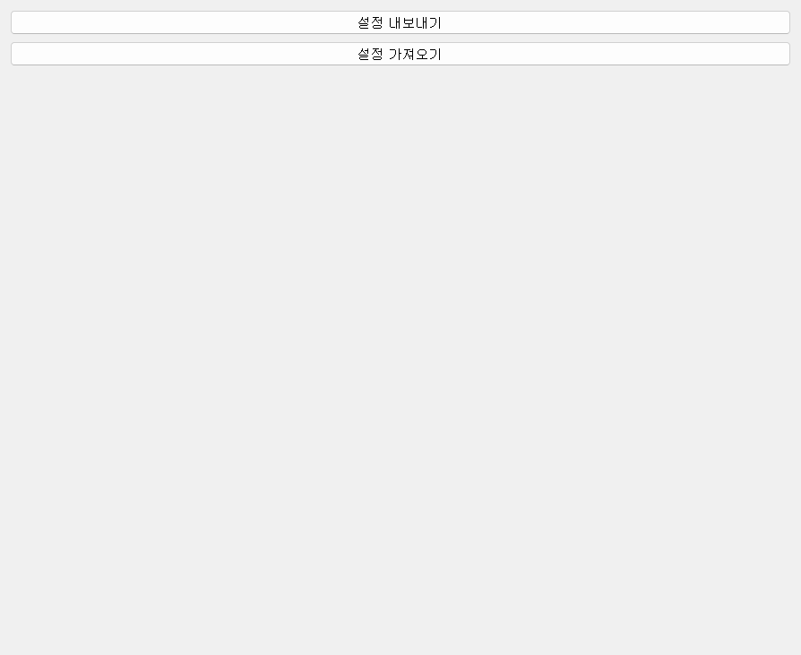

# 02-8. 설정 관리

`setting_doc` 전체를 zip으로 **백업·복원**하는 탭입니다. 다른 탭에서 바꾼 값은 보통 자동 저장되므로, 여기서는 주로 PC 이전·업데이트 전후에 씁니다.

## 설정 내보내기

**설정 내보내기** — `config.yaml`, 캐릭터별 yaml, 프롬프트 등을 zip 파일 하나로 저장합니다. Hugging Face에서 새 zip을 받기 **전에** 백업해 두면 API 키·캐릭터 튜닝을 잃지 않습니다.

## 설정 가져오기

**설정 가져오기** — 이전에 내보낸 zip을 선택하면 `setting_doc` 아래를 **덮어씁니다**.

[[WARNING("WARNING")]]
가져오기는 현재 설정을 대체합니다. 덮어쓰기 전에 **설정 내보내기**로 백업하세요.
[[/WARNING]]

## config.yaml 직접 편집

고급 사용자는 프로그램을 **종료한 뒤** `setting_doc/config.yaml`을 텍스트 에디터로 수정할 수 있습니다. UI에 없는 옵션(`show_browser`, `react_to_comments_immediately` 등)도 여기서 넣을 수 있습니다.

버전은 앱 하단 또는 `version.yaml`에서 확인하고 [변경 이력](https://wikidocs.net/372523)과 맞춰 보세요.
