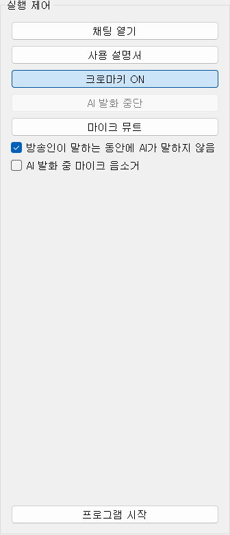
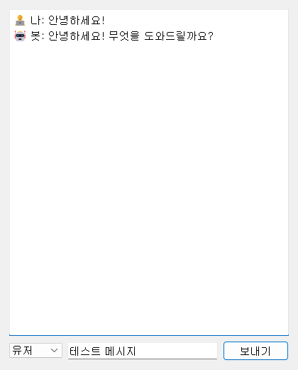

# 02-9. 실행 제어

우측 **실행 제어** 패널입니다. 방송 중에 자주 누르는 버튼·체크박스가 모여 있으며, **프로그램 실행 중에도 즉시** 적용됩니다.

## 프로그램 시작

**프로그램 시작** — STT·TTS·채팅/후원 모니터 등 백엔드를 기동합니다. Unity 클라이언트를 **먼저** 켠 뒤 누르는 것을 권장합니다.

정상이면 로그에 `Connected to server at ws://localhost:8765`가 보입니다.

## 테스트·도움말

**채팅 열기** — 마이크 없이 텍스트로 AI와 대화해 봅니다. 설정·프롬프트 테스트용입니다.

**사용 설명서** — 이 WikiDocs 메뉴얼을 브라우저에서 엽니다.

## 방송 중 제어

**크로마키 ON/OFF** — Unity 배경을 그린 스크린(크로마키) 모드로 전환합니다. OBS 합성용입니다.

**AI 발화 중단** — AI TTS를 일시 멈춥니다. **프로그램 시작** 후 AI가 말할 때만 활성화됩니다. 다시 누르면 재개됩니다.

**마이크 뮤트** — STT 입력을 끕니다. AI가 마이크 소리를 듣지 않게 할 때 씁니다.

## STT·TTS 겹침 방지

**방송인이 말하는 동안에 AI가 말하지 않음** — 마이크로 사람 발화가 감지되면 AI TTS를 끊거나 말하지 않습니다. 스트리머와 AI 목소리가 겹치는 것을 막습니다.

**AI 발화 중 마이크 음소거** — AI가 말하는 동안 STT 입력을 잠시 끕니다. AI 목소리가 마이크로 다시 들어가 에코·오인식이 나는 것을 줄입니다.

## 권장 순서

1. [Unity 클라이언트](https://wikidocs.net/372516) 실행
2. [AI 모델](https://wikidocs.net/372526)·[캐릭터](https://wikidocs.net/372527)·[오디오·음성](https://wikidocs.net/372528) 확인
3. **프로그램 시작**
4. 마이크로 말하거나 **채팅 열기**로 테스트

문제가 있으면 [문제 해결](https://wikidocs.net/372522)을 참고하세요.
