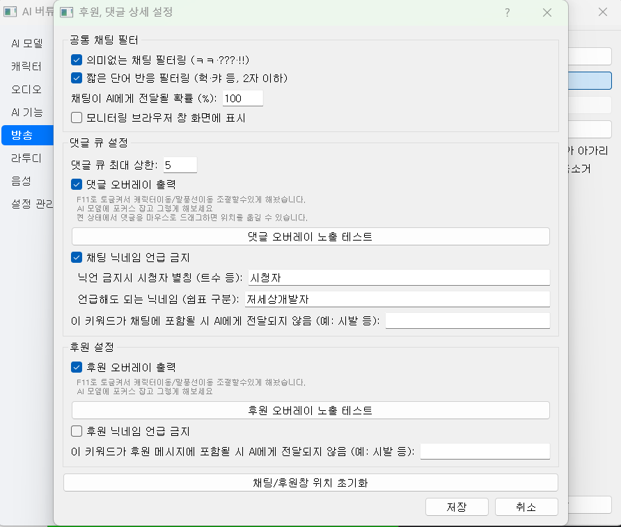

# 03. 방송 연동

**방송** 탭에서 위플랩·투네이션 알림을 AI 반응에 연결합니다.

## 위플랩 채팅

1. **위플랩 채팅 댓글 감지 및 반응** 체크
2. **위플랩 채팅 URL** — 위플랩 채팅 오버레이 페이지 URL 입력
3. (선택) **후원, 댓글 상세 설정** — 필터·닉네임·큐 크기

[위플랩 채팅](https://weflab.com/chat)에서 **채팅창** → **URL** 복사.

- **시청자 댓글에 반응** 체크
- **위플랩 채팅창 URL** 입력
- 시나리오에서 **시청자와의 대화** 선택 (닉네임 언급 반응)

AI가 말하는 중에는 새 댓글이 큐에 쌓였다가 TTS 종료 후 처리됩니다. 스트리머가 말하는 중(VAD)에는 댓글 응답을 건너뜁니다.

## 위플랩 후원

1. **위플랩 후원 감지 및 반응** 체크
2. **위플랩 후원 URL** — 후원 오버레이 URL

후원이 들어오면 누적 댓글보다 **후원이 우선** 처리됩니다.

## 투네이션

1. **투네이션 알림박스 후원 감지** 체크
2. **투네이션 알림박스 URL** 입력

## 상세 설정 다이얼로그

**후원, 댓글 상세 설정**에서:

| 항목 | 설명 |
|------|------|
| 샘플링률 | 댓글 일부만 무작위 반응 |
| 의미 없는 채팅 필터 | 짧은·무의미 메시지 제외 |
| 차단 키워드·닉네임 | 블록 리스트 |
| 닉네임 필터 | 특정 닉네임을 «시청자» 등으로 치환 |
| 큐 최대 크기 | 한 번에 처리할 댓글 수 |
| 댓글 오버레이 출력 | AI가 반응하는 채팅을 Live2D에 표시 |
| 닉네임 언급 금지 | 닉네임 필터링 |

변경 사항은 **자동 저장**되며, 프로그램 실행 중 **즉시 반영**됩니다.

## 브라우저 창

`show_browser` 설정이 켜져 있으면 Playwright가 채팅/후원 페이지를 띄워 모니터링합니다. 디버그 시 유용합니다.

## 즉시 반응

`react_to_comments_immediately` — 댓글 수신 즉시 응답 큐에 넣습니다 (`config.yaml`).

## 오버레이

채팅·후원이 들어올 때 Unity 화면에 **말풍선 오버레이**를 표시할 수 있습니다.

### 표시 조건

- AI가 해당 댓글/후원에 **응답하기 시작할 때** overlay 이벤트가 Unity로 전송됩니다
- `show_comment_overlay` / `show_donation_overlay` (config 또는 상세 설정)

### 자막과의 차이

| 요소 | 내용 |
|------|------|
| **자막** | AI가 **말하는 대사** (TTS와 동기) |
| **오버레이** | **시청자 채팅·후원** 말풍선 |

STT interrupt 시 `clear_overlay`만 보내지고 **자막은 별도** 동작합니다.

### 크로마키 방송

OBS 등에서 Unity 창을 캡처할 때 오버레이·자막이 함께 녹화됩니다. 크로마키 ON 시 배경만 제거됩니다.

오버레이가 안 보이면 Unity 연결·`show_*_overlay` 설정을 확인하세요.
