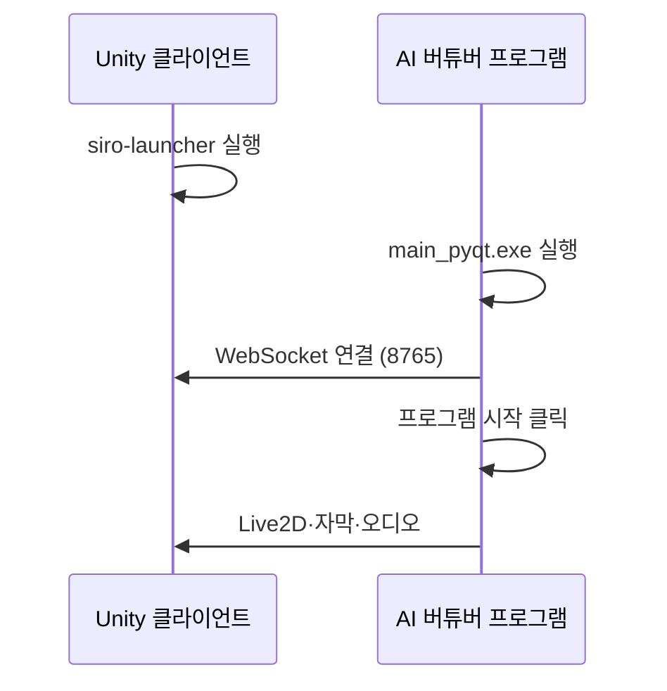

# 첫 실행

## 실행 순서

1. **Unity 클라이언트**를 먼저 실행합니다.
2. **AI 버튜버 실행 프로그램** (`main_pyqt.exe` 또는 배포 런처)을 실행합니다.
3. 좌측 탭에서 **AI 모델** — 사용할 LLM과 API 키를 확인합니다.
4. **캐릭터** 탭 — 캐릭터 폴더·시나리오를 선택합니다.
5. **오디오·음성** 탭 — 마이크, STT, TTS 모듈을 설정합니다.
6. 우측 **실행 제어** → **프로그램 시작**을 클릭합니다.
7. 초기화가 끝나면 마이크로 말해 보세요.

## AI 모델 탭 (필수)

| 항목 | 설명 |
|------|------|
| 메인 모델 종류 | 응답 생성에 쓸 LLM (Gemini, ChatGPT 등) |
| 메인 모델명 | 모델 ID (기본값 사용 가능) |
| API 키 | 선택한 제공자의 키 |

서브모델·임베딩은 메모리·요약·레퍼런스 검색에 사용됩니다. 기본값으로 시작해도 됩니다.

## 캐릭터 탭

| 항목 | 설명 |
|------|------|
| 캐릭터 폴더 | `setting_doc` 하위 캐릭터 (예: `siro`) |
| 시나리오 | 방송 상황 프롬프트 |
| 프롬프트 편집 | 캐릭터 성격·말투 (고급) |

## 오디오·음성 탭 (요약)

- **마이크** — STT 입력 장치 선택
- **STT** — faster-whisper(로컬) 또는 OpenAI Realtime
- **TTS** — `tts 모듈`(GPT-SoVITS), Supertone, MiniMax 등

자세한 내용은 [[09. 오디오·음성|오디오·음성]]을 참고하세요.

## 실행 제어 패널

| 버튼/옵션 | 설명 |
|-----------|------|
| 프로그램 시작 | STT·TTS·채팅 모니터 등 백엔드 기동 |
| 채팅 열기 | 텍스트로 AI와 대화 (테스트용) |
| 마이크 뮤트 | STT 입력 끄기 |
| 방송인이 말하는 동안 AI가 말하지 않음 | STT 감지 시 AI TTS 중단 |
| AI 발화 중 마이크 음소거 | AI가 말할 때 마이크 끄기 |

## 정상 동작 확인

- Unity 콘솔/로그에 WebSocket 연결 메시지
- Python 쪽 `Connected to server at ws://localhost:8765`
- 말하면 자막이 Unity에 표시되고 AI가 응답

문제가 있으면 [[15. 문제 해결|문제 해결]]을 참고하세요.
